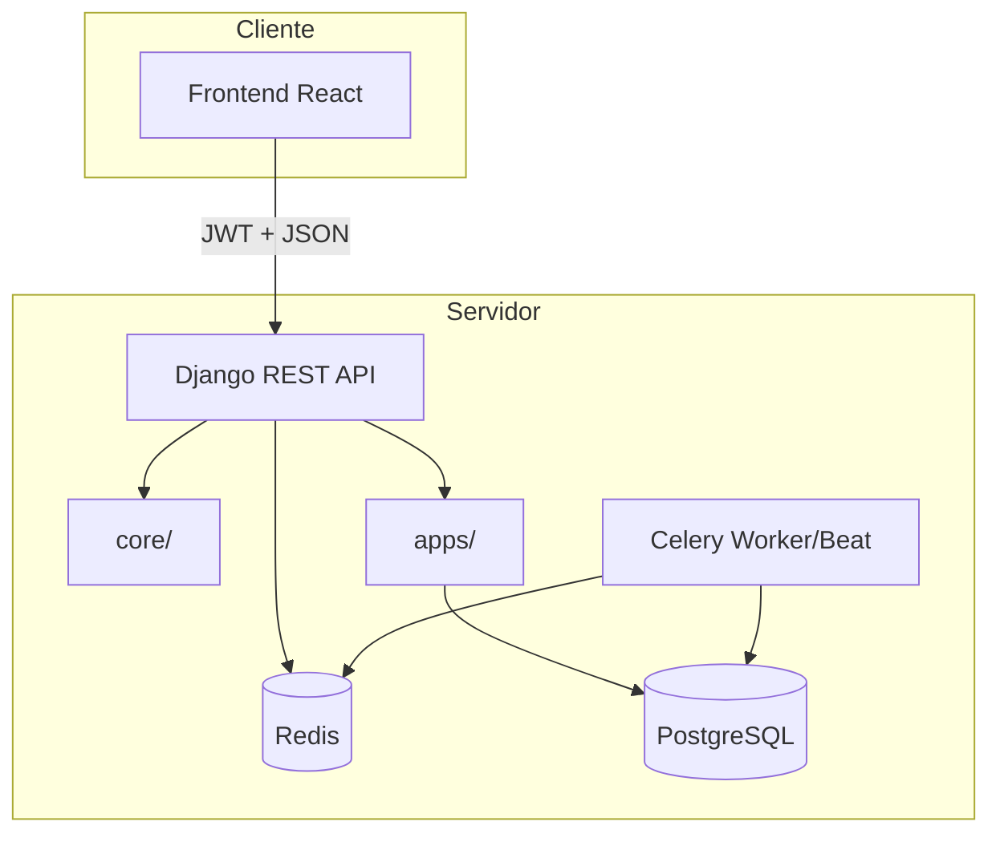
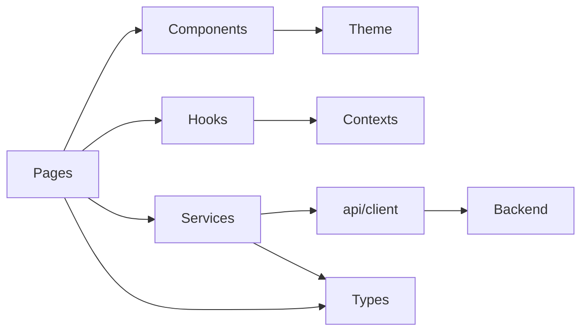

# Arquitetura do SGCS

Documento de referência da arquitetura do **Sistema de Gestão Clínica SauVida (SGCS)**.

## Visão geral

O SGCS segue uma arquitetura **full-stack desacoplada**:

- **Frontend**: SPA React com TypeScript
- **Backend**: API REST Django + DRF
- **Base de dados**: PostgreSQL
- **Comunicação**: HTTP/JSON com autenticação JWT



## Backend

### Estrutura de pastas

```
backend/
├── apps/                    # Módulos de domínio (Django apps)
│   ├── authentication/      # Autenticação JWT (ativo)
│   ├── users/               # Gestão de utilizadores
│   ├── patients/            # Pacientes
│   ├── appointments/        # Consultas / marcações
│   ├── reception/           # Receção
│   ├── doctors/             # Médicos
│   ├── laboratory/          # Laboratório
│   ├── billing/             # Faturação
│   ├── finance/             # Finanças
│   ├── reports/             # Relatórios
│   ├── dashboard/           # Dashboard
│   ├── notifications/       # Notificações
│   ├── audit_logs/          # Registos de auditoria
│   ├── settings/            # Configurações da clínica (label: clinic_settings)
│   ├── files/               # Uploads e documentos
│   ├── analytics/           # Métricas (preparado)
│   └── common/              # Partilhado entre apps
├── core/                    # Utilitários transversais
│   ├── config/              # constants, enums, feature_flags, cache, storage
│   ├── events/              # Event bus pub/sub
│   ├── health/              # Probes operacionais
│   ├── constants.py
│   ├── exceptions.py
│   ├── mixins.py
│   ├── pagination.py
│   ├── permissions.py
│   ├── responses.py
│   ├── utils.py
│   └── validators.py
└── config/                  # Configuração Django + Celery
```

### Princípios

| Princípio | Aplicação |
|-----------|-----------|
| **Separação por domínio** | Cada módulo clínico é uma Django app independente |
| **Core transversal** | Lógica partilhada (paginação, permissões, exceções) em `core/` |
| **RBAC** | Permissões baseadas em perfis via `core.permissions` |
| **Autenticação isolada** | App `authentication` mantém o modelo `User` e endpoints JWT |

### Apps preparadas (Sprint 2.1) e implementadas (Sprint 3–4)

As apps de domínio foram criadas com estrutura base na Sprint 2.1. Os módulos **Utilizadores** (Sprint 3) e **Pacientes** (Sprint 4) estão totalmente implementados com API REST, RBAC, auditoria e frontend.

| App | Estado |
|-----|--------|
| `authentication`, `users`, `audit_logs`, `dashboard` | Implementados (Sprint 3) |
| `patients` | **Implementado** (Sprint 4) — ver [docs/Patients/](./Patients/README.md) |
| `reception` | **Implementado** (Sprint 5) — check-in, fila, encaminhamentos |
| `appointments` | **Implementado** (Sprint 6) — agenda, PCE, pedidos lab |
| `laboratory` | **Implementado** (Sprint 7) — pedidos (Fase 1) e resultados (Fase 2) |
| `billing` | **Implementado** (Sprint 8 Fase 1) — faturação completa |
| `finance` | **Implementado** (Sprint 8 Fase 2) — tesouraria, caixa, despesas, relatórios |
| `reports` | **Implementado** (Sprint 9) — BI, relatórios, exportação, dashboard executivo |
| `settings` | **Implementado** (Sprint 10) — configuração clínica, segurança, feature flags |
| `doctors` | **Implementado** (Sprint 11) — prescrições, tratamentos, evolução, alta, seguimento |
| `notifications` | **Implementado** (Sprint 12) — notificações, e-mail, SMS, templates, preferências |

**Apps especiais:**

- **notifications** — inclui `services.py` e `signals.py` preparados
- **audit_logs** — inclui `services.py` e `signals.py` preparados

### Módulo `appointments` (Sprint 6 — Fase 1)

```
apps/appointments/
├── models.py              # Consulta (estados PT, número CON-AAAA-NNNNN)
├── constants.py           # Estados, prioridades
├── validators.py          # Sobreposição de médico, data no passado
├── services/
│   ├── appointment_service.py   # criar, reagendar, confirmar, iniciar, concluir, cancelar
│   └── number_service.py        # Numeração sequencial
├── tasks.py               # Celery: lembrete de consulta (preparado)
├── permissions.py         # RBAC appointments.*
├── filters.py             # Filtros de listagem
└── tests/                 # Models, services, API, RBAC, workflow, dashboard
```

Integrações: `reception` (handoff via `assign-to-doctor`), `patients`, `users`, `audit_logs`, `dashboard`, Redis (cache), Celery (stub).

### PCE — Prontuário Clínico Eletrónico (Sprint 6 Fase 2)

Modelos: `SinaisVitais`, `AnotacaoClinica` (SOAP), `Diagnostico`, `PedidoLaboratorio`, `PedidoImagiologia`, `Seguimento`.

Serviço: `ClinicalRecordService` — validação médico + estado `EM_CONSULTA`, bloqueio após conclusão, auditoria por acção.

Frontend: `ConsultaClinica` com `ResumoPaciente`, separadores (Resumo, Sinais Vitais, SOAP, Diagnósticos, Laboratório, **Resultados Laboratoriais**, Imagiologia, Seguimento, Histórico).

### Módulo `laboratory` (Sprint 7 — Fase 1)

Modelos: `PedidoLaboratorial`, `ExameLaboratorial`. Estados: PENDENTE → RECEBIDO → AGUARDANDO_COLHEITA → EM_PROCESSAMENTO → CONCLUIDO.

Serviço: `LaboratoryService` — receber, colheita, processar, concluir. Integração automática via `criar_de_pedido_consulta()` quando o médico emite pedido na consulta.

Frontend: `features/laboratory/` — painel, pendentes, do dia, fila de colheitas, detalhe.

### Resultados laboratoriais (Sprint 7 — Fase 2)

Modelos: `ResultadoLaboratorial`, `ParametroResultado`, `AnexoResultado`. Estados: EM_PROCESSAMENTO → RESULTADO_PENDENTE → VALIDADO → ENTREGUE.

Serviço: `LaboratoryResultService` — criar, editar, parâmetros, validar, publicar, anexos. Ao validar: actualiza pedido/consulta/PCE, `PatientHistory`, dashboard, auditoria e event bus (`laboratory.result.*`).

Tarefas Celery: `publicar_resultado`, `actualizar_dashboard`, `notificar_medico`, `actualizar_prontuario`.

Frontend: `features/laboratory/results/` — painel, novo, editar, detalhe, histórico; componentes `ResultadoForm`, `ParametroEditor`, `UploadResultado`, etc.

### Módulo `billing` (Sprint 8 — Fase 1)

Modelos: `Servico`, `Orcamento`, `ItemOrcamento`, `Fatura`, `ItemFatura`, `Pagamento`, `Recibo`.

Numeração: `ORC-AAAA-000001`, `FAT-AAAA-000001`, `REC-AAAA-000001`.

Serviço: `BillingService` — criar/aprovar orçamento, gerar fatura, registar/confirmar pagamento, emitir recibo, histórico financeiro. Totais calculados automaticamente; uma fatura por consulta; bloqueio de edição após pagamento total.

Integração: `PatientDependencyService.has_pending_invoices()`, dashboard `/dashboard/billing/`, event bus `billing.*`, Celery preparado.

Frontend: `features/billing/` — painel, serviços, orçamentos, faturas, pagamentos, recibos, histórico.

### Módulo `finance` (Sprint 8 — Fase 2)

Modelos: `Caixa`, `MovimentoFinanceiro`, `Despesa`, `CategoriaFinanceira`.

Estados caixa: ABERTO / FECHADO. Tipos de movimento: ENTRADA, SAIDA, TRANSFERENCIA, AJUSTE. Workflow despesa: PENDENTE → APROVADA → PAGA → CANCELADA.

Serviço: `FinanceService` — abrir/fechar caixa, movimentos, despesas, fluxo de caixa, dashboard, relatórios diário/mensal/anual.

Integração Billing: `confirmar_pagamento()` dispara `processar_pagamento_billing()` — movimento ENTRADA, actualização de caixa, cache Redis (TTL 60s), auditoria e event bus (`finance.payment.received`).

Permissões: `finance.view`, `finance.create`, `finance.edit`, `finance.delete`, `finance.cash`, `finance.expense`, `finance.report`, `finance.dashboard`. Perfil `FINANCEIRO` com acesso completo.

Tarefas Celery (stub): `gerar_relatorio_pdf`, `enviar_relatorio_email`, `fechar_caixa`, `backup_financeiro`.

Frontend: `features/finance/` — painel, caixas, movimentos, despesas, relatórios. Rotas `/finance/*`.

### Módulo `reports` (Sprint 9)

Serviços: `ReportService`, `StatisticsService`, `ReportsDashboardService`, `PdfExportService`, `ExcelExportService`, `CsvExportService`, `ReportsCacheService`.

Endpoints: `/api/v1/reports/patients|appointments|reception|laboratory|billing|finance/`, `/charts/`, `/statistics/`. Dashboard executivo: `/api/v1/dashboard/executive/`.

Exportação real via `?export=pdf|xlsx|csv` (reportlab, openpyxl, csv). Cache Redis TTL 120s. Eventos: `report.generated`, `dashboard.updated`, `statistics.updated`. Celery stubs: `gerar_pdf`, `gerar_excel`, `gerar_csv`, `enviar_relatorio`, `recalcular_estatisticas`.

Permissões: `reports.view`, `reports.export`, `reports.dashboard`, `reports.statistics`. Perfil `DIRECTOR` com acesso BI.

Frontend: `features/reports/` — painel, relatórios por domínio, dashboard executivo. Rotas `/reports/*`.

### Módulo `settings` (Sprint 10)

Modelos: `PerfilClinica`, `EspecialidadeMedica`, `Departamento`, `Consultorio`, `HorarioFuncionamento`, `Feriado`, `TipoConsulta`, `TipoExameLaboratorio`, configurações singleton (faturação, e-mail, SMS, segurança, ficheiros), `FeatureFlag`, `BackupRegisto`.

Serviços: `SettingsService`, `BackupService`, `MonitoringService`, `SettingsCacheService` (TTL 300s).

Endpoints: `/api/v1/settings/*`, dashboard `/api/v1/dashboard/system/`.

Permissões: `settings.view`, `settings.edit`, `settings.security`, `settings.backup`, `settings.system`, `settings.email`, `settings.featureflags`.

Frontend: `features/settings/` — rotas `/settings/*`.

### Módulo `doctors` (Sprint 11)

Modelos: `Prescricao`, `MedicamentoPrescrito`, `PlanoTerapeutico`, `Tratamento`, `EvolucaoClinica`, `AltaMedica`, `SeguimentoClinico`.

Serviços: `PrescriptionService`, `TreatmentService`, `ClinicalEvolutionService`, `DischargeService`, `FollowupService`, `DoctorsCacheService` (TTL 120s).

Endpoints: `/api/v1/prescriptions/`, `/treatments/`, `/evolutions/`, `/discharges/`, `/followups/` — acções `approve`, `finish`, `history`.

Permissões: `doctors.prescription`, `doctors.treatment`, `doctors.evolution`, `doctors.discharge`, `doctors.followup`. Perfis `MEDICO`, `ADMINISTRADOR`, `DIRECTOR`.

Integrações: consultas (`Appointment`), pacientes, PCE, laboratório, faturação, auditoria, event bus (`doctor.prescription.created`, `doctor.discharge.created`, `doctor.followup.created`), Celery stubs.

Frontend: `features/doctors/` — rotas `/doctor/*`. Ver [docs/Doctors/README.md](./Doctors/README.md).

### Módulo `notifications` (Sprint 12)

Modelos: `Notificacao`, `TemplateEmail`, `TemplateSMS`, `PreferenciaNotificacao`, `HistoricoEmail`, `HistoricoSMS`, `FilaNotificacao`.

Serviços: `NotificationService`, `EmailService`, `SMSService`, `TemplateService`, `NotificationPreferenceService`, `NotificationQueueService`, `NotificationCacheService` (TTL 120s).

Endpoints: `/api/v1/notifications/`, sub-recursos `email/`, `sms/`, `templates/`, `preferences/`. Dashboard: `/api/v1/dashboard/notifications/`.

Permissões: `notifications.view`, `notifications.create`, `notifications.edit`, `notifications.delete`, `notifications.send`, `notifications.template`, `notifications.settings`, `notifications.history`.

Integrações: Event Bus (subscrição automática a eventos de domínio), Celery (`enviar_email`, `enviar_sms`, `processar_fila`, `reenviar_falhas`, `limpar_notificacoes_antigas`), auditoria, Redis.

Frontend: `features/notifications/` — rotas `/notifications/*`, `NotificationBell` no header. Ver [docs/Notifications/README.md](./Notifications/README.md).

### Infraestrutura de produção (Sprint 13)

- `core/cache/cache_helper.py` — cache central com TTL configurável
- `core/security/` — middleware, throttling, login guard, validação uploads
- `core/monitoring/health_service.py` — health checks avançados
- `core/storage/storage_service.py` — armazenamento abstracto
- `core/logging_config.py` — logs rotativos (application, security, audit, errors)
- `core/tasks/base.py` — Celery com retry e dead-letter básico

Documentação: [Performance.md](./Performance.md), [Security.md](./Security.md), [Production.md](./Production.md), [Monitoring.md](./Monitoring.md).

### Módulo `core`

| Ficheiro | Responsabilidade |
|----------|------------------|
| `constants.py` | Perfis, formatos de data, moeda (FCFA) |
| `exceptions.py` | Exceções API padronizadas |
| `mixins.py` | `TimestampMixin`, `SoftDeleteMixin` |
| `pagination.py` | Paginação padrão (20 itens/página) |
| `permissions.py` | Permissões RBAC por perfil |
| `responses.py` | Formato de resposta `{ success, message, data }` |
| `utils.py` | Formatação de datas e helpers |
| `validators.py` | Validação de telefone e montantes |

### Módulo `core/config` (Sprint 3.5)

| Ficheiro | Responsabilidade |
|----------|------------------|
| `constants.py` | Código da app, versão, chaves de cache |
| `enums.py` | Ambiente, backends de cache e storage |
| `feature_flags.py` | Ativação gradual via variáveis de ambiente |
| `cache.py` | Configuração Redis / fallback LocMem |
| `storage.py` | Paths de upload e media |

### Event Bus (`core/events/`)

Infraestrutura interna de publicação/subscrição:

- `events.py` — `DomainEvent` e nomes padronizados
- `subscribers.py` — registo de handlers
- `dispatcher.py` — execução segura
- `event_bus.py` — API `publish()` / `subscribe()`

Controlado por `FEATURE_EVENT_BUS_ENABLED`. Não altera endpoints existentes; integrações futuras subscrevem eventos.

### Health Probes (`core/health/`)

| Endpoint | Tipo | Verifica |
|----------|------|----------|
| `/health/` | Geral | App, versão, ambiente |
| `/live/` | Liveness | Processo em execução |
| `/ready/` | Readiness | PostgreSQL + Redis/cache + módulo `patients` |

### Celery e Redis

- **Redis**: cache Django (`django-redis`) e broker Celery
- **Worker**: `celery -A config worker`
- **Beat**: tarefa exemplo `sgcs.ping` a cada 60s
- Configuração em `config/celery.py` e `config/tasks.py`

## Frontend

### Estrutura de pastas

```
frontend/src/
├── design-system/    # Button, Input, Card, Modal, Table, Badge, Avatar, Toast, etc.
├── features/         # Estrutura por domínio (migração gradual)
│   ├── authentication/
│   ├── users/
│   ├── dashboard/
│   ├── settings/
│   ├── patients/
│   ├── appointments/
│   ├── laboratory/
│   └── billing/
├── components/
│   ├── ui/           # Legado — mantido até migração completa
│   ├── forms/        # Componentes de formulário (Sprint 3+)
│   ├── tables/       # Table
│   ├── charts/       # Gráficos (Sprint 3+)
│   └── feedback/     # Toast
├── constants/        # Rotas, perfis, API, formatação
├── contexts/         # Estado global (AuthContext)
├── hooks/            # Hooks personalizados
├── layouts/          # Layouts da aplicação
├── pages/            # Páginas por rota
├── routes/           # Definição de rotas e guards
├── services/         # Comunicação com a API
│   ├── api/
│   ├── auth/
│   ├── users/
│   ├── patients/
│   ├── appointments/
│   ├── laboratory/
│   ├── billing/
│   └── dashboard/
├── theme/            # Cores e tipografia
├── types/            # Tipos TypeScript por domínio
└── utils/            # Utilitários
```

### Camadas do frontend



### Serviços

Cada módulo de serviço segue o padrão:

```
services/<modulo>/
├── <modulo>.service.ts   # Chamadas HTTP
└── index.ts              # Re-exports
```

Os ficheiros legados `api.ts` e `auth-service.ts` mantêm re-exports para compatibilidade.

### Design System (Sprint 3.5)

Biblioteca paralela em `src/design-system/` com 12 componentes base. Novos ecrãs devem importar daqui; `components/ui/` permanece para compatibilidade.

### Features (Sprint 3.5)

Estrutura `src/features/<domínio>/` criada com documentação de migração. Ficheiros legados em `pages/` e `services/` **não foram movidos** nesta sprint.

## Autenticação

Fluxo JWT inalterado desde a Sprint 2:

1. `POST /api/v1/auth/login/` — obtém access + refresh tokens
2. Access token enviado em `Authorization: Bearer`
3. Refresh automático via interceptor Axios em `services/api/client.ts`
4. `POST /api/v1/auth/logout/` — invalida refresh token

## Convenções

| Área | Convenção |
|------|-----------|
| Idioma UI | Português |
| Datas | DD/MM/AAAA |
| Moeda | FCFA (XOF) |
| API prefix | `/api/v1/` |
| Perfis | ADMINISTRADOR, RECECIONISTA, MEDICO, ENFERMEIRO, LABORATORIO, FINANCEIRO |

## Roadmap de módulos

| Sprint | Módulos |
|--------|---------|
| Sprint 2 | Ambiente + autenticação |
| Sprint 2.1 | Reorganização arquitetural |
| Sprint 3 | Gestão de Utilizadores, RBAC, Auditoria, Dashboard Admin |
| Sprint 3.5 | Fundação empresarial (Redis, Celery, event bus, health, design system) |
| Sprint 4 | **Gestão de Pacientes** — ver [docs/Patients/](./Patients/README.md) |
| Sprint 5 | **Receção** — check-in, fila, encaminhamentos, KPIs |
| Sprint 6 | **Consultas médicas** — agenda, calendário, workflow clínico, KPIs |
| Sprint 7 | **Laboratório** — pedidos (Fase 1) e resultados laboratoriais (Fase 2) |
| Sprint 8 | **Faturação** (Fase 1) e **Financeiro** (Fase 2) |
| Sprint 9 | **Relatórios e BI** |
| Sprint 10 | **Administração e Configuração** |
| Sprint 11 | **Módulo Médico** (prescrições, tratamentos, evolução, alta) |
| Sprint 12 | **Notificações e Comunicações** |
| Sprint 13 | **Otimização e Produção** |
| Sprint 13+ | Farmácia |

## Evolução prevista

1. Migrar páginas legadas para `src/features/` módulo a módulo
2. Adotar `design-system/` nos novos ecrãs
3. Publicar eventos de domínio via `core.events` onde fizer sentido
4. Expor APIs de `settings`, `files` e `analytics` quando os módulos clínicos avançarem
5. Ativar `notifications` e `audit_logs` com signals e serviços
