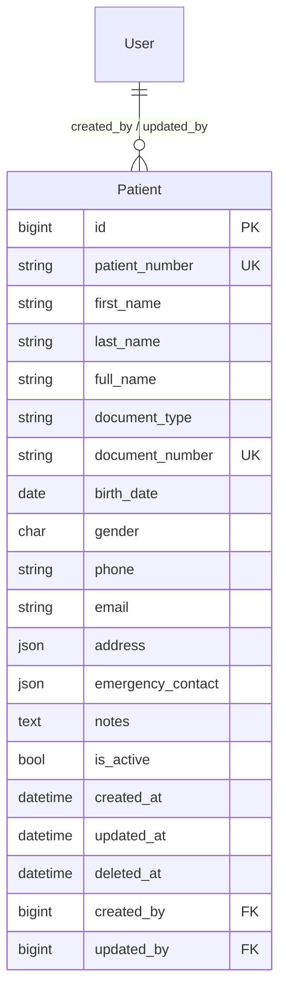

# Arquitetura Técnica — Módulo de Gestão de Pacientes

**Projeto:** SGCS  
**Sprint:** 4  
**Versão:** 1.0

Este documento descreve a arquitetura técnica planeada, alinhada com os padrões já estabelecidos no módulo `users` (Sprint 3) e na fundação empresarial (Sprint 3.5).

---

## 8. Estrutura das APIs

### 8.1 Convenções gerais

| Aspeto | Padrão SGCS |
|--------|-------------|
| Prefixo | `/api/v1/` |
| Autenticação | JWT Bearer (`Authorization: Bearer <access>`) |
| Formato de sucesso | `{ "success": true, "message": "...", "data": <T> }` |
| Formato de erro | `{ "success": false, "message": "...", "errors": {...} }` |
| Paginação | `page`, `page_size` (default 20, max 100) |
| Pesquisa | `search` (SearchFilter DRF) |
| Ordenação | `ordering` (ex: `last_name`, `-created_at`) |
| Filtros | django-filter (`PatientFilter`) |
| Documentação | drf-spectacular / Swagger em `/api/docs/` |

### 8.2 Montagem de URLs

Registo planeado em `config/urls.py` (sem alterar rotas existentes):

```python
path("api/v1/patients/", include("apps.patients.urls")),
```

Router interno (`apps/patients/urls.py`):

```python
router = DefaultRouter()
router.register("", PatientViewSet, basename="patient")
urlpatterns = router.urls
```

### 8.3 Endpoints

#### CRUD principal

| Método | Endpoint | Permissão | Descrição |
|--------|----------|-----------|-----------|
| `GET` | `/api/v1/patients/` | `patients.view` | Listagem paginada |
| `POST` | `/api/v1/patients/` | `patients.create` | Criar paciente |
| `GET` | `/api/v1/patients/{id}/` | `patients.view` | Detalhe do paciente |
| `PATCH` | `/api/v1/patients/{id}/` | `patients.edit` | Atualização parcial |
| `PUT` | `/api/v1/patients/{id}/` | `patients.edit` | Atualização completa |
| `DELETE` | `/api/v1/patients/{id}/` | `patients.delete` | Soft delete |

#### Ações customizadas

| Método | Endpoint | Permissão | Descrição |
|--------|----------|-----------|-----------|
| `POST` | `/api/v1/patients/{id}/activate/` | `patients.edit` | Reativar paciente inativo |
| `POST` | `/api/v1/patients/{id}/deactivate/` | `patients.delete` | Desativar sem soft delete |
| `GET` | `/api/v1/patients/check-duplicate/` | `patients.create` | Verificar duplicados |
| `GET` | `/api/v1/patients/export/` | `patients.export` | Exportar CSV (Sprint 4.2) |
| `GET` | `/api/v1/patients/{id}/print/` | `patients.print` | PDF ficha resumo (Sprint 4.2) |
| `GET` | `/api/v1/patients/{id}/audit-trail/` | `patients.view` | Histórico de alterações |

### 8.4 Parâmetros de listagem

```
GET /api/v1/patients/?page=1&page_size=20&search=Silva&is_active=true&gender=M&ordering=last_name
```

| Parâmetro | Tipo | Descrição |
|-----------|------|-----------|
| `page` | int | Número da página |
| `page_size` | int | Itens por página (max 100) |
| `search` | string | Pesquisa em nome, documento, telefone, nº processo |
| `is_active` | bool | Filtrar ativos/inativos |
| `gender` | string | `M`, `F`, `O` |
| `include_deleted` | bool | Apenas admin — incluir soft deleted |
| `ordering` | string | Campo de ordenação |

### 8.5 Payload — Criar paciente

**Request** `POST /api/v1/patients/`

```json
{
  "first_name": "Maria",
  "last_name": "Mendes",
  "document_number": "123456789LA045",
  "document_type": "BI",
  "birth_date": "15/03/1990",
  "gender": "F",
  "phone": "+245955123456",
  "email": "maria.mendes@email.com",
  "address": {
    "street": "Rua da Independência",
    "city": "Bissau",
    "country": "Guiné-Bissau"
  },
  "emergency_contact": {
    "name": "João Mendes",
    "phone": "+245955654321",
    "relationship": "Cônjuge"
  },
  "notes": "Alergia a penicilina"
}
```

**Response** `201 Created`

```json
{
  "success": true,
  "message": "Paciente registado com sucesso.",
  "data": {
    "id": 1,
    "patient_number": "PAC-2026-00001",
    "first_name": "Maria",
    "last_name": "Mendes",
    "full_name": "Maria Mendes",
    "document_number": "123456789LA045",
    "document_type": "BI",
    "birth_date": "15/03/1990",
    "gender": "F",
    "phone": "+245955123456",
    "email": "maria.mendes@email.com",
    "address": { "..." },
    "emergency_contact": { "..." },
    "notes": "Alergia a penicilina",
    "is_active": true,
    "created_at": "03/07/2026 14:30",
    "updated_at": "03/07/2026 14:30"
  }
}
```

### 8.6 Payload — Listagem

**Response** `200 OK`

```json
{
  "success": true,
  "message": "Listagem obtida com sucesso.",
  "data": {
    "count": 150,
    "next": "http://localhost:8000/api/v1/patients/?page=2",
    "previous": null,
    "results": [
      {
        "id": 1,
        "patient_number": "PAC-2026-00001",
        "full_name": "Maria Mendes",
        "phone": "+245955123456",
        "document_number": "123456789LA045",
        "birth_date": "15/03/1990",
        "gender": "F",
        "is_active": true
      }
    ]
  }
}
```

### 8.7 Códigos HTTP

| Código | Situação |
|--------|----------|
| `200` | Sucesso (GET, PATCH, ações) |
| `201` | Criado |
| `400` | Validação falhou |
| `401` | Não autenticado |
| `403` | Sem permissão RBAC |
| `404` | Paciente não encontrado |
| `409` | Conflito (documento duplicado) |
| `500` | Erro interno |

### 8.8 Serializers planejados

| Serializer | Uso |
|------------|-----|
| `PatientListSerializer` | Listagem — campos reduzidos |
| `PatientDetailSerializer` | Detalhe completo |
| `PatientCreateSerializer` | Criação com validações de negócio |
| `PatientUpdateSerializer` | Edição parcial |
| `PatientDuplicateCheckSerializer` | Resposta de verificação de duplicados |
| `AddressSerializer` | Objeto aninhado de morada |
| `EmergencyContactSerializer` | Contacto de emergência |

### 8.9 ViewSet — padrão de implementação

Espelha `UserViewSet` em `apps/users/views.py`:

```python
class PatientViewSet(viewsets.ModelViewSet):
    pagination_class = StandardPagination
    filterset_class = PatientFilter
    search_fields = ["first_name", "last_name", "document_number", "phone", "patient_number"]
    ordering_fields = ["last_name", "first_name", "created_at", "birth_date"]
    ordering = ["last_name", "first_name"]

    def get_permissions(self):
        return [HasModulePermission()]

    @property
    def required_permission(self) -> str:
        # Mapeamento action → codename (como UserViewSet)
        ...
```

---

## 9. Estrutura do Frontend

### 9.1 Organização de ficheiros

Estratégia: implementar inicialmente em `pages/patients/` e migrar gradualmente para `features/patients/` (conforme `features/README.md`).

```
frontend/src/
├── features/patients/              # Destino final (Sprint 4+)
│   ├── README.md                   # ✅ Existe
│   ├── pages/
│   │   ├── PatientsListPage.tsx
│   │   ├── PatientFormPage.tsx
│   │   └── PatientDetailPage.tsx
│   ├── components/
│   │   ├── PatientTable.tsx
│   │   ├── PatientFilters.tsx
│   │   ├── PatientSummaryCard.tsx
│   │   └── DuplicateAlert.tsx
│   ├── hooks/
│   │   ├── usePatients.ts
│   │   └── usePatient.ts
│   └── services/                   # Migração futura de services/patients/
│
├── pages/patients/                 # Implementação inicial Sprint 4.1
│   ├── PatientsListPage.tsx
│   ├── PatientFormPage.tsx
│   └── PatientDetailPage.tsx
│
├── services/patients/              # ✅ Stub existente — expandir
│   ├── patients.service.ts
│   └── index.ts
│
├── types/patient.ts                # ✅ Existe — expandir
├── schemas/patientSchema.ts        # Novo — validação Zod
└── constants/routes.ts             # Adicionar ROUTES.PATIENTS*
```

### 9.2 Rotas

Registo em `routes/index.tsx` sob `AppLayout` (módulo clínico, **não** `AdminLayout`):

| Rota | Componente | Permissão mínima |
|------|------------|------------------|
| `/patients` | `PatientsListPage` | `patients.view` |
| `/patients/new` | `PatientFormPage` | `patients.create` |
| `/patients/:id` | `PatientDetailPage` | `patients.view` |
| `/patients/:id/edit` | `PatientFormPage` | `patients.edit` |

Constantes em `constants/routes.ts`:

```typescript
export const ROUTES = {
  // ... existentes
  PATIENTS: "/patients",
  PATIENTS_NEW: "/patients/new",
  PATIENT_DETAIL: (id: number | string) => `/patients/${id}`,
  PATIENT_EDIT: (id: number | string) => `/patients/${id}/edit`,
} as const;
```

### 9.3 Serviço API

Padrão alinhado com `usersService`:

```typescript
export const patientsService = {
  list: (params?: PatientFilters) => Promise<PaginatedResponse<PatientListItem>>,
  get: (id: number) => Promise<Patient>,
  create: (payload: PatientPayload) => Promise<Patient>,
  update: (id: number, payload: Partial<PatientPayload>) => Promise<Patient>,
  remove: (id: number) => Promise<ApiEnvelope<null>>,
  activate: (id: number) => Promise<Patient>,
  deactivate: (id: number) => Promise<Patient>,
  checkDuplicate: (params: DuplicateCheckParams) => Promise<DuplicateCheckResult>,
  export: (params?: PatientFilters) => Promise<Blob>,
};
```

### 9.4 Tipos TypeScript

Expandir `types/patient.ts`:

```typescript
export interface Patient extends BaseEntity {
  patient_number: string;
  first_name: string;
  last_name: string;
  full_name: string;
  document_number?: string;
  document_type?: DocumentType;
  phone: string;
  email?: string;
  birth_date: string;
  gender: PatientGender;
  address?: PatientAddress;
  emergency_contact?: EmergencyContact;
  notes?: string;
  is_active: boolean;
}

export interface PatientPayload { /* campos de escrita */ }
export interface PatientFilters extends PaginationParams {
  search?: string;
  is_active?: boolean;
  gender?: PatientGender;
}
```

### 9.5 Páginas — composição

#### Lista (`PatientsListPage`)

| Elemento | Componente / padrão |
|----------|---------------------|
| Layout | `AppLayout` |
| Título | "Pacientes" + subtítulo |
| CTA | `Button` → `/patients/new` (se `patients.create`) |
| Filtros | `Input` search + select estado |
| Tabela | `Table` do design-system |
| Estados | `LoadingState`, `EmptyState`, `ErrorState` |
| Paginação | Botões prev/next (padrão users) ou `Pagination` |
| Data fetching | `useQuery(["patients", page, search, filters])` |

#### Formulário (`PatientFormPage`)

| Elemento | Padrão |
|----------|--------|
| Form | react-hook-form + zodResolver(patientSchema) |
| Secções | Dados pessoais, Documento, Contacto, Morada, Emergência |
| Validação | Campos obrigatórios, telefone, data, menor de idade |
| Duplicados | `DuplicateAlert` antes de submeter |
| Ações | Guardar, Cancelar |

#### Ficha (`PatientDetailPage`)

| Elemento | Conteúdo |
|----------|----------|
| Cabeçalho | Nome, nº processo, badge estado |
| Cards | Dados pessoais, contacto, morada, notas |
| Ações | Editar, Desativar, Imprimir (conforme permissões) |
| Secções futuras | Consultas, Exames, Faturas (placeholder desativado) |

### 9.6 Navegação

Adicionar link **"Pacientes"** em `AppHeader` visível para perfis com `patients.view` (não em `AdminLayout`).

```typescript
// Visibilidade baseada em permissions do perfil (GET /api/v1/users/profile/)
permissions.includes("patients.view")
```

### 9.7 Design system

Novos ecrãs devem importar de `@/design-system`:

- `Button`, `Input`, `Card`, `Table`, `Badge`, `Modal`
- `LoadingState`, `EmptyState`, `ErrorState`
- `ToastProvider` / `useToast` para feedback de mutações

---

## 10. Estrutura do Backend

### 10.1 Organização da app `patients`

```
backend/apps/patients/
├── __init__.py
├── apps.py                         # PatientsConfig
├── models.py                       # Patient, enums
├── serializers.py                  # CRUD serializers
├── views.py                        # PatientViewSet
├── urls.py                         # DefaultRouter
├── admin.py                        # PatientAdmin
├── filters.py                      # PatientFilter
├── services/
│   ├── __init__.py
│   ├── patient_service.py          # Lógica de negócio
│   ├── duplicate_service.py        # Deteção de duplicados
│   └── number_service.py           # Geração PAC-AAAA-NNNNN
├── migrations/
│   └── 0001_initial.py
└── tests/
    ├── __init__.py
    ├── test_models.py
    ├── test_api.py
    ├── test_permissions.py
    ├── test_audit.py
    └── test_duplicates.py
```

### 10.2 Modelo de dados

#### Entidade principal: `Patient`

| Campo | Tipo | Obrigatório | Notas |
|-------|------|-------------|-------|
| `id` | BigAutoField | PK | |
| `patient_number` | CharField(20) | Sim | Único, auto-gerado, imutável |
| `first_name` | CharField(100) | Sim | |
| `last_name` | CharField(100) | Sim | |
| `full_name` | CharField(201) | Sim | Calculado: first + last |
| `document_type` | CharField(20) | Não | BI, PASSAPORTE, OUTRO |
| `document_number` | CharField(50) | Não | Único se preenchido |
| `birth_date` | DateField | Sim | |
| `gender` | CharField(1) | Sim | M, F, O |
| `phone` | CharField(20) | Sim | Validado |
| `email` | EmailField | Não | Único se preenchido |
| `address` | JSONField | Não | `{ street, city, region, country }` |
| `emergency_contact` | JSONField | Não | `{ name, phone, relationship }` |
| `notes` | TextField | Não | Alergias, observações |
| `is_active` | BooleanField | Sim | Default True |
| `created_at` | DateTimeField | Auto | TimestampMixin |
| `updated_at` | DateTimeField | Auto | TimestampMixin |
| `deleted_at` | DateTimeField | Não | SoftDeleteMixin |
| `created_by` | FK → User | Não | Quem registou |
| `updated_by` | FK → User | Não | Última edição |

#### Índices planeados

```python
class Meta:
    indexes = [
        models.Index(fields=["last_name", "first_name"]),
        models.Index(fields=["document_number"]),
        models.Index(fields=["patient_number"]),
        models.Index(fields=["phone"]),
        models.Index(fields=["is_active", "deleted_at"]),
    ]
    constraints = [
        models.UniqueConstraint(
            fields=["document_number"],
            condition=models.Q(document_number__gt=""),
            name="unique_patient_document",
        ),
    ]
```

### 10.3 Diagrama entidade-relacionamento (módulo patients)



### 10.4 Camada de serviços

#### `PatientService`

| Método | Responsabilidade |
|--------|------------------|
| `create(data, user)` | Valida, gera número, grava, audita, publica evento |
| `update(patient, data, user)` | Merge parcial, valida duplicados, audita |
| `deactivate(patient, user)` | Soft delete ou is_active=false |
| `activate(patient, user)` | Reativa paciente |
| `get_active_queryset()` | Exclui soft deleted por defeito |

#### `PatientNumberService`

```python
# Formato: PAC-{ANO}-{SEQUENCIA:05d}
# Exemplo: PAC-2026-00042
def generate_next() -> str: ...
```

#### `DuplicateService`

```python
def find_potential_duplicates(
    first_name, last_name, birth_date, phone, document_number=None
) -> list[Patient]: ...
```

### 10.5 Integração com `core/`

| Módulo core | Utilização |
|-------------|------------|
| `mixins.TimestampMixin` | `created_at`, `updated_at` |
| `mixins.SoftDeleteMixin` | `deleted_at`, `soft_delete()`, `restore()` |
| `validators.validate_phone_number` | Campo `phone` |
| `responses.success_response` / `error_response` | Todas as views |
| `pagination.StandardPagination` | Listagem |
| `exceptions.BusinessRuleException` | Regras RN-* |
| `events.EventNames` | `patient.created`, `patient.updated` (Sprint 4.4) |

### 10.6 Admin Django

Registo em `admin.py` para suporte operacional:

- List display: `patient_number`, `full_name`, `phone`, `is_active`
- Filtros: `is_active`, `gender`, `created_at`
- Search: `full_name`, `document_number`, `patient_number`
- Read-only: `patient_number`, `created_at`, `updated_at`

### 10.7 Testes planeados

| Ficheiro | Cobertura |
|----------|-----------|
| `test_models.py` | Geração de número, full_name, constraints |
| `test_api.py` | CRUD, paginação, filtros, envelope |
| `test_permissions.py` | Matriz RBAC por perfil |
| `test_audit.py` | Ações auditadas em mutações |
| `test_duplicates.py` | RN-02, RN-03, alertas |

Fixtures em `conftest.py`: reutilizar `seed_rbac`, `admin_user`, `receptionist_user`.

### 10.8 Dependências entre apps

```
apps.patients
  → apps.authentication (User FK)
  → apps.users (HasModulePermission, RBACService)
  → apps.audit_logs (AuditService)
  → core.* (mixins, responses, validators, pagination)

Futuro:
  apps.appointments → FK Patient
  apps.laboratory   → FK Patient
  apps.billing      → FK Patient
  apps.reception    → FK Patient (check-in)
  apps.files        → FK Patient (documentos)
```
