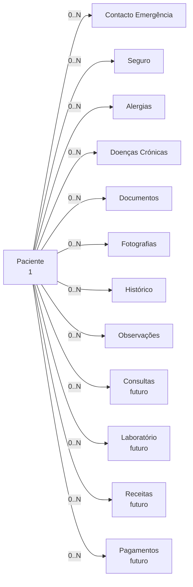

# Modelo de Dados — Módulo de Gestão de Pacientes

**Projeto:** SGCS — Sistema de Gestão Clínica SauVida  
**Sprint:** 4  
**Versão:** 1.0  
**Motor:** PostgreSQL 16  
**App Django:** `apps.patients`  
**Estado:** Especificação — **sem migrations**

> Este documento é a referência autoritativa do esquema relacional do módulo Pacientes. Substitui os campos JSON (`address`, `emergency_contact`) descritos na versão inicial de `Arquitetura-Tecnica.md` por entidades normalizadas.

---

## Índice

1. [Visão geral](#1-visão-geral)
2. [Convenções](#2-convenções)
3. [Diagrama ER](#3-diagrama-er)
4. [Entidades do módulo](#4-entidades-do-módulo)
5. [Entidades futuras (stubs)](#5-entidades-futuras-stubs)
6. [Regras de integridade](#6-regras-de-integridade)
7. [Índices consolidados](#7-índices-consolidados)
8. [Mapa de tabelas](#8-mapa-de-tabelas)
9. [Evolução e migrações](#9-evolução-e-migrações)

---

## 1. Visão geral

O modelo de dados do módulo Pacientes centra-se na entidade **`patients_patient`** (Paciente), à qual se associam registos clínicos e administrativos em tabelas satélite. A estrutura é **normalizada (3FN)** para evitar redundância, facilitar auditoria e suportar crescimento do prontuário.

### Princípios de desenho

| Princípio | Aplicação |
|-----------|-----------|
| Entidade raiz | `Patient` é referenciada por todos os módulos clínicos e financeiros |
| Normalização | Contactos, seguros, alergias e doenças em tabelas próprias |
| Rastreabilidade | `created_by` / `updated_by` → `authentication_user` |
| Soft delete | Apenas na entidade `Patient` (ciclo de vida principal) |
| Ficheiros | Documentos e fotografias ligam a `files_storedfile` (Sprint 3.5) |
| Extensibilidade | FKs reservadas para Consultas, Laboratório, Receitas e Pagamentos |

### Apps envolvidas

| App | Papel |
|-----|-------|
| `apps.patients` | Todas as tabelas `patients_*` |
| `apps.authentication` | `authentication_user` (FK de auditoria) |
| `apps.files` | `files_storedfile` (armazenamento binário) |
| `apps.appointments` | `appointments_appointment` *(futuro)* |
| `apps.laboratory` | `laboratory_lab_order` *(futuro)* |
| `apps.prescriptions` ou `apps.doctors` | `prescriptions_prescription` *(futuro)* |
| `apps.billing` / `apps.finance` | `billing_payment` *(futuro)* |

---

## 2. Convenções

| Aspeto | Convenção |
|--------|-----------|
| Nome de tabela | `{app_label}_{model_name}` em minúsculas |
| Chave primária | `id` — `BIGSERIAL` / `BigAutoField` |
| Timestamps | `created_at`, `updated_at` em todas as entidades mutáveis |
| Booleanos ativos | `is_active` — default `TRUE` |
| Textos longos | `TEXT` no PostgreSQL |
| Datas de negócio | `DATE`; eventos com hora — `TIMESTAMP WITH TIME ZONE` |
| Enums | `VARCHAR` com `choices` Django (sem tabelas de lookup na Sprint 4) |
| FK on delete | `RESTRICT` para `patient_id`; `SET_NULL` para utilizadores |
| Timezone | `Africa/Bissau` (Django `USE_TZ=True`) |

---

## 3. Diagrama ER

```mermaid
erDiagram
    authentication_user ||--o{ patients_patient : "created_by / updated_by"
    authentication_user ||--o{ patients_emergency_contact : "created_by"
    authentication_user ||--o{ patients_insurance : "created_by"
    authentication_user ||--o{ patients_allergy : "recorded_by"
    authentication_user ||--o{ patients_chronic_disease : "recorded_by"
    authentication_user ||--o{ patients_document : "uploaded_by"
    authentication_user ||--o{ patients_photo : "uploaded_by"
    authentication_user ||--o{ patients_history : "recorded_by"
    authentication_user ||--o{ patients_observation : "created_by / updated_by"

    patients_patient ||--o{ patients_emergency_contact : "tem"
    patients_patient ||--o{ patients_insurance : "tem"
    patients_patient ||--o{ patients_allergy : "tem"
    patients_patient ||--o{ patients_chronic_disease : "tem"
    patients_patient ||--o{ patients_document : "tem"
    patients_patient ||--o{ patients_photo : "tem"
    patients_patient ||--o{ patients_history : "tem"
    patients_patient ||--o{ patients_observation : "tem"

    files_storedfile ||--o| patients_document : "ficheiro"
    files_storedfile ||--o| patients_photo : "imagem"

    patients_patient ||--o{ appointments_appointment : "futuro"
    patients_patient ||--o{ laboratory_lab_order : "futuro"
    patients_patient ||--o{ prescriptions_prescription : "futuro"
    patients_patient ||--o{ billing_payment : "futuro"

    patients_patient {
        bigint id PK
        varchar patient_number UK
        varchar first_name
        varchar last_name
        varchar full_name
        varchar document_type
        varchar document_number
        date birth_date
        char gender
        varchar phone
        varchar email
        varchar address_street
        varchar address_city
        varchar address_region
        varchar address_country
        varchar address_postal_code
        varchar nationality
        varchar blood_type
        varchar marital_status
        varchar occupation
        boolean is_active
        boolean is_deleted
        timestamptz deleted_at
        timestamptz created_at
        timestamptz updated_at
        bigint created_by_id FK
        bigint updated_by_id FK
    }

    patients_emergency_contact {
        bigint id PK
        bigint patient_id FK
        varchar name
        varchar phone
        varchar email
        varchar relationship
        boolean is_primary
        boolean is_active
        timestamptz created_at
        timestamptz updated_at
        bigint created_by_id FK
    }

    patients_insurance {
        bigint id PK
        bigint patient_id FK
        varchar provider_name
        varchar policy_number
        varchar plan_type
        date valid_from
        date valid_until
        boolean is_primary
        boolean is_active
        text notes
        timestamptz created_at
        timestamptz updated_at
        bigint created_by_id FK
    }

    patients_allergy {
        bigint id PK
        bigint patient_id FK
        varchar allergen
        varchar severity
        varchar reaction
        date diagnosed_at
        boolean is_active
        text notes
        timestamptz created_at
        timestamptz updated_at
        bigint recorded_by_id FK
    }

    patients_chronic_disease {
        bigint id PK
        bigint patient_id FK
        varchar disease_name
        varchar icd_code
        date diagnosed_at
        varchar status
        boolean is_active
        text notes
        timestamptz created_at
        timestamptz updated_at
        bigint recorded_by_id FK
    }

    patients_document {
        bigint id PK
        bigint patient_id FK
        bigint stored_file_id FK
        varchar document_type
        varchar title
        varchar document_number
        text description
        date issued_at
        date expires_at
        boolean is_active
        timestamptz created_at
        timestamptz updated_at
        bigint uploaded_by_id FK
    }

    patients_photo {
        bigint id PK
        bigint patient_id FK
        bigint stored_file_id FK
        boolean is_primary
        varchar caption
        timestamptz taken_at
        boolean is_active
        timestamptz created_at
        timestamptz updated_at
        bigint uploaded_by_id FK
    }

    patients_history {
        bigint id PK
        bigint patient_id FK
        varchar event_type
        varchar title
        text description
        timestamptz event_date
        varchar source_module
        bigint source_id
        jsonb metadata
        timestamptz created_at
        bigint recorded_by_id FK
    }

    patients_observation {
        bigint id PK
        bigint patient_id FK
        varchar observation_type
        text content
        boolean is_pinned
        boolean is_active
        timestamptz created_at
        timestamptz updated_at
        bigint created_by_id FK
        bigint updated_by_id FK
    }

    appointments_appointment {
        bigint id PK
        bigint patient_id FK
        string status
        string note
    }

    laboratory_lab_order {
        bigint id PK
        bigint patient_id FK
        string status
    }

    prescriptions_prescription {
        bigint id PK
        bigint patient_id FK
        string status
    }

    billing_payment {
        bigint id PK
        bigint patient_id FK
        decimal amount
        string status
    }
```

---

## 4. Entidades do módulo

### 4.1 `patients_patient` — Paciente

Entidade central do módulo. Representa o utente da clínica.

#### Chave primária

| Coluna | Tipo | Restrição |
|--------|------|-----------|
| `id` | `BIGSERIAL` | `PRIMARY KEY` |

#### Campos

| Coluna | Tipo PostgreSQL | Django | Nulo | Default | Descrição |
|--------|-----------------|--------|:----:|---------|-----------|
| `patient_number` | `VARCHAR(20)` | `CharField(20)` | Não | — | Nº processo clínico (`PAC-AAAA-NNNNN`), imutável |
| `first_name` | `VARCHAR(100)` | `CharField(100)` | Não | — | Nome próprio |
| `last_name` | `VARCHAR(100)` | `CharField(100)` | Não | — | Apelido |
| `full_name` | `VARCHAR(201)` | `CharField(201)` | Não | — | Nome completo (calculado/gravado) |
| `document_type` | `VARCHAR(20)` | `CharField(20)` | Sim | `NULL` | `BI`, `PASSAPORTE`, `CARTAO_RESIDENTE`, `OUTRO` |
| `document_number` | `VARCHAR(50)` | `CharField(50)` | Sim | `NULL` | Nº documento de identificação |
| `birth_date` | `DATE` | `DateField` | Não | — | Data de nascimento |
| `gender` | `CHAR(1)` | `CharField(1)` | Não | — | `M`, `F`, `O` |
| `phone` | `VARCHAR(20)` | `CharField(20)` | Não | — | Telefone principal |
| `email` | `VARCHAR(254)` | `EmailField` | Sim | `NULL` | E-mail de contacto |
| `address_street` | `VARCHAR(255)` | `CharField(255)` | Sim | `NULL` | Morada — rua |
| `address_city` | `VARCHAR(100)` | `CharField(100)` | Sim | `NULL` | Cidade |
| `address_region` | `VARCHAR(100)` | `CharField(100)` | Sim | `NULL` | Região / província |
| `address_country` | `VARCHAR(100)` | `CharField(100)` | Sim | `'Guiné-Bissau'` | País |
| `address_postal_code` | `VARCHAR(20)` | `CharField(20)` | Sim | `NULL` | Código postal |
| `nationality` | `VARCHAR(100)` | `CharField(100)` | Sim | `NULL` | Nacionalidade |
| `blood_type` | `VARCHAR(5)` | `CharField(5)` | Sim | `NULL` | `A+`, `A-`, `B+`, `B-`, `AB+`, `AB-`, `O+`, `O-`, `DESCONHECIDO` |
| `marital_status` | `VARCHAR(20)` | `CharField(20)` | Sim | `NULL` | `SOLTEIRO`, `CASADO`, `DIVORCIADO`, `VIUVO`, `OUTRO` |
| `occupation` | `VARCHAR(150)` | `CharField(150)` | Sim | `NULL` | Profissão |
| `is_active` | `BOOLEAN` | `BooleanField` | Não | `TRUE` | Utente ativo na clínica |
| `is_deleted` | `BOOLEAN` | `BooleanField` | Não | `FALSE` | Flag de soft delete |
| `deleted_at` | `TIMESTAMPTZ` | `DateTimeField` | Sim | `NULL` | Data/hora de eliminação lógica |
| `created_at` | `TIMESTAMPTZ` | `DateTimeField` | Não | `now()` | Criação do registo |
| `updated_at` | `TIMESTAMPTZ` | `DateTimeField` | Não | `now()` | Última atualização |
| `created_by_id` | `BIGINT` | `ForeignKey` | Sim | `NULL` | Utilizador que registou |
| `updated_by_id` | `BIGINT` | `ForeignKey` | Sim | `NULL` | Utilizador da última edição |

#### Chaves estrangeiras

| Coluna | Referência | ON DELETE | ON UPDATE |
|--------|------------|-----------|-----------|
| `created_by_id` | `authentication_user(id)` | `SET NULL` | `CASCADE` |
| `updated_by_id` | `authentication_user(id)` | `SET NULL` | `CASCADE` |

#### Restrições (constraints)

| Nome | Tipo | Definição |
|------|------|-----------|
| `patients_patient_pkey` | PRIMARY KEY | `(id)` |
| `patients_patient_patient_number_key` | UNIQUE | `(patient_number)` |
| `patients_patient_unique_document` | UNIQUE parcial | `(document_number) WHERE document_number IS NOT NULL AND document_number <> ''` |
| `patients_patient_unique_email_active` | UNIQUE parcial | `(email) WHERE email IS NOT NULL AND is_deleted = FALSE` |
| `patients_patient_gender_check` | CHECK | `gender IN ('M', 'F', 'O')` |
| `patients_patient_birth_date_check` | CHECK | `birth_date <= CURRENT_DATE` |

#### Índices

| Nome | Colunas | Tipo | Notas |
|------|---------|------|-------|
| `patients_patient_pkey` | `id` | B-tree (PK) | Automático |
| `patients_patient_patient_number_key` | `patient_number` | B-tree (UNIQUE) | Automático |
| `idx_patient_full_name` | `full_name` | B-tree | Pesquisa por nome |
| `idx_patient_last_first` | `last_name`, `first_name` | B-tree | Ordenação listagem |
| `idx_patient_document` | `document_number` | B-tree | Pesquisa por documento |
| `idx_patient_phone` | `phone` | B-tree | Pesquisa por telefone |
| `idx_patient_active_deleted` | `is_active`, `is_deleted` | B-tree | Filtro listagem padrão |
| `idx_patient_birth_date` | `birth_date` | B-tree | Relatórios demográficos |

---

### 4.2 `patients_emergency_contact` — Contacto de Emergência

Um paciente pode ter **vários** contactos de emergência; um deve ser marcado como principal.

#### Chave primária

| Coluna | Tipo | Restrição |
|--------|------|-----------|
| `id` | `BIGSERIAL` | `PRIMARY KEY` |

#### Campos

| Coluna | Tipo | Nulo | Default | Descrição |
|--------|------|:----:|---------|-----------|
| `patient_id` | `BIGINT` | Não | — | FK → paciente |
| `name` | `VARCHAR(150)` | Não | — | Nome do contacto |
| `phone` | `VARCHAR(20)` | Não | — | Telefone de emergência |
| `email` | `VARCHAR(254)` | Sim | `NULL` | E-mail opcional |
| `relationship` | `VARCHAR(50)` | Não | — | `CONJUGE`, `PAI`, `MAE`, `FILHO`, `IRMAO`, `AMIGO`, `OUTRO` |
| `is_primary` | `BOOLEAN` | Não | `FALSE` | Contacto principal |
| `is_active` | `BOOLEAN` | Não | `TRUE` | Registo ativo |
| `created_at` | `TIMESTAMPTZ` | Não | `now()` | — |
| `updated_at` | `TIMESTAMPTZ` | Não | `now()` | — |
| `created_by_id` | `BIGINT` | Sim | `NULL` | FK → utilizador |

#### Chaves estrangeiras

| Coluna | Referência | ON DELETE |
|--------|------------|-----------|
| `patient_id` | `patients_patient(id)` | `RESTRICT` |
| `created_by_id` | `authentication_user(id)` | `SET NULL` |

#### Restrições

| Nome | Tipo | Definição |
|------|------|-----------|
| `patients_emergency_contact_pkey` | PRIMARY KEY | `(id)` |
| `uniq_patient_primary_emergency` | UNIQUE parcial | `(patient_id) WHERE is_primary = TRUE AND is_active = TRUE` — apenas um principal ativo |

#### Índices

| Nome | Colunas |
|------|---------|
| `idx_emergency_contact_patient` | `patient_id` |
| `idx_emergency_contact_primary` | `patient_id`, `is_primary` |

---

### 4.3 `patients_insurance` — Seguro

Informação de seguro de saúde ou plano de cobertura do paciente.

#### Chave primária

| Coluna | Tipo | Restrição |
|--------|------|-----------|
| `id` | `BIGSERIAL` | `PRIMARY KEY` |

#### Campos

| Coluna | Tipo | Nulo | Default | Descrição |
|--------|------|:----:|---------|-----------|
| `patient_id` | `BIGINT` | Não | — | FK → paciente |
| `provider_name` | `VARCHAR(150)` | Não | — | Seguradora / entidade |
| `policy_number` | `VARCHAR(50)` | Não | — | Nº apólice / beneficiário |
| `plan_type` | `VARCHAR(50)` | Sim | `NULL` | `BASICO`, `COMPLETO`, `EMPRESA`, `ESTADO`, `OUTRO` |
| `valid_from` | `DATE` | Sim | `NULL` | Início de validade |
| `valid_until` | `DATE` | Sim | `NULL` | Fim de validade |
| `is_primary` | `BOOLEAN` | Não | `FALSE` | Seguro principal |
| `is_active` | `BOOLEAN` | Não | `TRUE` | Cobertura ativa |
| `notes` | `TEXT` | Sim | `NULL` | Observações |
| `created_at` | `TIMESTAMPTZ` | Não | `now()` | — |
| `updated_at` | `TIMESTAMPTZ` | Não | `now()` | — |
| `created_by_id` | `BIGINT` | Sim | `NULL` | FK → utilizador |

#### Chaves estrangeiras

| Coluna | Referência | ON DELETE |
|--------|------------|-----------|
| `patient_id` | `patients_patient(id)` | `RESTRICT` |
| `created_by_id` | `authentication_user(id)` | `SET NULL` |

#### Restrições

| Nome | Tipo | Definição |
|------|------|-----------|
| `patients_insurance_pkey` | PRIMARY KEY | `(id)` |
| `patients_insurance_valid_dates_check` | CHECK | `valid_until IS NULL OR valid_from IS NULL OR valid_until >= valid_from` |
| `uniq_patient_primary_insurance` | UNIQUE parcial | `(patient_id) WHERE is_primary = TRUE AND is_active = TRUE` |

#### Índices

| Nome | Colunas |
|------|---------|
| `idx_insurance_patient` | `patient_id` |
| `idx_insurance_policy` | `policy_number` |
| `idx_insurance_active` | `patient_id`, `is_active` |

---

### 4.4 `patients_allergy` — Alergias

Registo de alergias conhecidas do paciente (dados clínicos críticos).

#### Chave primária

| Coluna | Tipo | Restrição |
|--------|------|-----------|
| `id` | `BIGSERIAL` | `PRIMARY KEY` |

#### Campos

| Coluna | Tipo | Nulo | Default | Descrição |
|--------|------|:----:|---------|-----------|
| `patient_id` | `BIGINT` | Não | — | FK → paciente |
| `allergen` | `VARCHAR(150)` | Não | — | Substância alergénica |
| `severity` | `VARCHAR(20)` | Não | `'MODERADA'` | `LEVE`, `MODERADA`, `GRAVE`, `ANAFILAXIA` |
| `reaction` | `VARCHAR(255)` | Sim | `NULL` | Descrição da reação |
| `diagnosed_at` | `DATE` | Sim | `NULL` | Data de diagnóstico |
| `is_active` | `BOOLEAN` | Não | `TRUE` | Alergia atualmente relevante |
| `notes` | `TEXT` | Sim | `NULL` | Notas clínicas |
| `created_at` | `TIMESTAMPTZ` | Não | `now()` | — |
| `updated_at` | `TIMESTAMPTZ` | Não | `now()` | — |
| `recorded_by_id` | `BIGINT` | Sim | `NULL` | FK → utilizador |

#### Chaves estrangeiras

| Coluna | Referência | ON DELETE |
|--------|------------|-----------|
| `patient_id` | `patients_patient(id)` | `RESTRICT` |
| `recorded_by_id` | `authentication_user(id)` | `SET NULL` |

#### Restrições

| Nome | Tipo | Definição |
|------|------|-----------|
| `patients_allergy_pkey` | PRIMARY KEY | `(id)` |
| `patients_allergy_severity_check` | CHECK | `severity IN ('LEVE','MODERADA','GRAVE','ANAFILAXIA')` |
| `uniq_patient_allergen_active` | UNIQUE parcial | `(patient_id, allergen) WHERE is_active = TRUE` — evita duplicados ativos |

#### Índices

| Nome | Colunas |
|------|---------|
| `idx_allergy_patient` | `patient_id` |
| `idx_allergy_allergen` | `allergen` |
| `idx_allergy_severity` | `patient_id`, `severity` |

---

### 4.5 `patients_chronic_disease` — Doenças Crónicas

Condições crónicas ou comorbilidades do paciente.

#### Chave primária

| Coluna | Tipo | Restrição |
|--------|------|-----------|
| `id` | `BIGSERIAL` | `PRIMARY KEY` |

#### Campos

| Coluna | Tipo | Nulo | Default | Descrição |
|--------|------|:----:|---------|-----------|
| `patient_id` | `BIGINT` | Não | — | FK → paciente |
| `disease_name` | `VARCHAR(200)` | Não | — | Nome da doença |
| `icd_code` | `VARCHAR(20)` | Sim | `NULL` | Código CID-10 (opcional) |
| `diagnosed_at` | `DATE` | Sim | `NULL` | Data de diagnóstico |
| `status` | `VARCHAR(20)` | Não | `'ATIVA'` | `ATIVA`, `CONTROLADA`, `REMISSAO`, `CURADA` |
| `is_active` | `BOOLEAN` | Não | `TRUE` | Registo ativo |
| `notes` | `TEXT` | Sim | `NULL` | Notas clínicas |
| `created_at` | `TIMESTAMPTZ` | Não | `now()` | — |
| `updated_at` | `TIMESTAMPTZ` | Não | `now()` | — |
| `recorded_by_id` | `BIGINT` | Sim | `NULL` | FK → utilizador |

#### Chaves estrangeiras

| Coluna | Referência | ON DELETE |
|--------|------------|-----------|
| `patient_id` | `patients_patient(id)` | `RESTRICT` |
| `recorded_by_id` | `authentication_user(id)` | `SET NULL` |

#### Restrições

| Nome | Tipo | Definição |
|------|------|-----------|
| `patients_chronic_disease_pkey` | PRIMARY KEY | `(id)` |
| `patients_chronic_disease_status_check` | CHECK | `status IN ('ATIVA','CONTROLADA','REMISSAO','CURADA')` |

#### Índices

| Nome | Colunas |
|------|---------|
| `idx_chronic_disease_patient` | `patient_id` |
| `idx_chronic_disease_icd` | `icd_code` |
| `idx_chronic_disease_status` | `patient_id`, `status` |

---

### 4.6 `patients_document` — Documentos

Metadados de documentos associados ao paciente. O ficheiro binário reside em `files_storedfile`.

#### Chave primária

| Coluna | Tipo | Restrição |
|--------|------|-----------|
| `id` | `BIGSERIAL` | `PRIMARY KEY` |

#### Campos

| Coluna | Tipo | Nulo | Default | Descrição |
|--------|------|:----:|---------|-----------|
| `patient_id` | `BIGINT` | Não | — | FK → paciente |
| `stored_file_id` | `BIGINT` | Não | — | FK → ficheiro armazenado |
| `document_type` | `VARCHAR(30)` | Não | — | Ver enum abaixo |
| `title` | `VARCHAR(200)` | Não | — | Título descritivo |
| `document_number` | `VARCHAR(50)` | Sim | `NULL` | Nº do documento (ex: BI) |
| `description` | `TEXT` | Sim | `NULL` | Descrição adicional |
| `issued_at` | `DATE` | Sim | `NULL` | Data de emissão |
| `expires_at` | `DATE` | Sim | `NULL` | Data de validade |
| `is_active` | `BOOLEAN` | Não | `TRUE` | Documento válido |
| `created_at` | `TIMESTAMPTZ` | Não | `now()` | — |
| `updated_at` | `TIMESTAMPTZ` | Não | `now()` | — |
| `uploaded_by_id` | `BIGINT` | Sim | `NULL` | FK → utilizador |

**Enum `document_type`:** `BI`, `PASSAPORTE`, `CARTAO_SEGURO`, `CONSENTIMENTO`, `EXAME_EXTERNO`, `DECLARACAO`, `OUTRO`

#### Chaves estrangeiras

| Coluna | Referência | ON DELETE |
|--------|------------|-----------|
| `patient_id` | `patients_patient(id)` | `RESTRICT` |
| `stored_file_id` | `files_storedfile(id)` | `RESTRICT` |
| `uploaded_by_id` | `authentication_user(id)` | `SET NULL` |

#### Restrições

| Nome | Tipo | Definição |
|------|------|-----------|
| `patients_document_pkey` | PRIMARY KEY | `(id)` |
| `patients_document_expires_check` | CHECK | `expires_at IS NULL OR issued_at IS NULL OR expires_at >= issued_at` |

#### Índices

| Nome | Colunas |
|------|---------|
| `idx_document_patient` | `patient_id` |
| `idx_document_type` | `patient_id`, `document_type` |
| `idx_document_stored_file` | `stored_file_id` |

---

### 4.7 `patients_photo` — Fotografias

Fotografias do paciente (perfil, identificação visual). Binário em `files_storedfile`.

#### Chave primária

| Coluna | Tipo | Restrição |
|--------|------|-----------|
| `id` | `BIGSERIAL` | `PRIMARY KEY` |

#### Campos

| Coluna | Tipo | Nulo | Default | Descrição |
|--------|------|:----:|---------|-----------|
| `patient_id` | `BIGINT` | Não | — | FK → paciente |
| `stored_file_id` | `BIGINT` | Não | — | FK → imagem armazenada |
| `is_primary` | `BOOLEAN` | Não | `FALSE` | Foto de perfil principal |
| `caption` | `VARCHAR(255)` | Sim | `NULL` | Legenda |
| `taken_at` | `TIMESTAMPTZ` | Sim | `NULL` | Data da fotografia |
| `is_active` | `BOOLEAN` | Não | `TRUE` | Foto ativa |
| `created_at` | `TIMESTAMPTZ` | Não | `now()` | — |
| `updated_at` | `TIMESTAMPTZ` | Não | `now()` | — |
| `uploaded_by_id` | `BIGINT` | Sim | `NULL` | FK → utilizador |

#### Chaves estrangeiras

| Coluna | Referência | ON DELETE |
|--------|------------|-----------|
| `patient_id` | `patients_patient(id)` | `RESTRICT` |
| `stored_file_id` | `files_storedfile(id)` | `RESTRICT` |
| `uploaded_by_id` | `authentication_user(id)` | `SET NULL` |

#### Restrições

| Nome | Tipo | Definição |
|------|------|-----------|
| `patients_photo_pkey` | PRIMARY KEY | `(id)` |
| `uniq_patient_primary_photo` | UNIQUE parcial | `(patient_id) WHERE is_primary = TRUE AND is_active = TRUE` |

#### Índices

| Nome | Colunas |
|------|---------|
| `idx_photo_patient` | `patient_id` |
| `idx_photo_primary` | `patient_id`, `is_primary` |

---

### 4.8 `patients_history` — Histórico

Linha do tempo clínica e administrativa do paciente. Registo **append-only** (sem `updated_at`).

#### Chave primária

| Coluna | Tipo | Restrição |
|--------|------|-----------|
| `id` | `BIGSERIAL` | `PRIMARY KEY` |

#### Campos

| Coluna | Tipo | Nulo | Default | Descrição |
|--------|------|:----:|---------|-----------|
| `patient_id` | `BIGINT` | Não | — | FK → paciente |
| `event_type` | `VARCHAR(30)` | Não | — | Tipo de evento (enum) |
| `title` | `VARCHAR(200)` | Não | — | Título resumido |
| `description` | `TEXT` | Sim | `NULL` | Descrição detalhada |
| `event_date` | `TIMESTAMPTZ` | Não | — | Data/hora do evento |
| `source_module` | `VARCHAR(30)` | Sim | `NULL` | Módulo de origem (`patients`, `appointments`, …) |
| `source_id` | `BIGINT` | Sim | `NULL` | ID do registo de origem |
| `metadata` | `JSONB` | Sim | `'{}'` | Dados adicionais estruturados |
| `created_at` | `TIMESTAMPTZ` | Não | `now()` | Momento do registo |
| `recorded_by_id` | `BIGINT` | Sim | `NULL` | FK → utilizador |

**Enum `event_type`:** `REGISTO`, `ADMISSAO`, `ALTA`, `CONSULTA`, `EXAME`, `DIAGNOSTICO`, `CIRURGIA`, `MEDICACAO`, `ALERGIA`, `DOENCA_CRONICA`, `DOCUMENTO`, `OBSERVACAO`, `PAGAMENTO`, `OUTRO`

#### Chaves estrangeiras

| Coluna | Referência | ON DELETE |
|--------|------------|-----------|
| `patient_id` | `patients_patient(id)` | `RESTRICT` |
| `recorded_by_id` | `authentication_user(id)` | `SET NULL` |

#### Restrições

| Nome | Tipo | Definição |
|------|------|-----------|
| `patients_history_pkey` | PRIMARY KEY | `(id)` |

#### Índices

| Nome | Colunas |
|------|---------|
| `idx_history_patient_date` | `patient_id`, `event_date DESC` |
| `idx_history_event_type` | `patient_id`, `event_type` |
| `idx_history_source` | `source_module`, `source_id` |

---

### 4.9 `patients_observation` — Observações

Notas clínicas ou administrativas em texto livre, com possibilidade de fixar observações importantes.

#### Chave primária

| Coluna | Tipo | Restrição |
|--------|------|-----------|
| `id` | `BIGSERIAL` | `PRIMARY KEY` |

#### Campos

| Coluna | Tipo | Nulo | Default | Descrição |
|--------|------|:----:|---------|-----------|
| `patient_id` | `BIGINT` | Não | — | FK → paciente |
| `observation_type` | `VARCHAR(20)` | Não | — | `CLINICA`, `ENFERMAGEM`, `ADMINISTRATIVA` |
| `content` | `TEXT` | Não | — | Texto da observação |
| `is_pinned` | `BOOLEAN` | Não | `FALSE` | Destacar na ficha |
| `is_active` | `BOOLEAN` | Não | `TRUE` | Observação visível |
| `created_at` | `TIMESTAMPTZ` | Não | `now()` | — |
| `updated_at` | `TIMESTAMPTZ` | Não | `now()` | — |
| `created_by_id` | `BIGINT` | Sim | `NULL` | FK → utilizador |
| `updated_by_id` | `BIGINT` | Sim | `NULL` | FK → utilizador |

#### Chaves estrangeiras

| Coluna | Referência | ON DELETE |
|--------|------------|-----------|
| `patient_id` | `patients_patient(id)` | `RESTRICT` |
| `created_by_id` | `authentication_user(id)` | `SET NULL` |
| `updated_by_id` | `authentication_user(id)` | `SET NULL` |

#### Restrições

| Nome | Tipo | Definição |
|------|------|-----------|
| `patients_observation_pkey` | PRIMARY KEY | `(id)` |
| `patients_observation_type_check` | CHECK | `observation_type IN ('CLINICA','ENFERMAGEM','ADMINISTRATIVA')` |
| `patients_observation_content_check` | CHECK | `length(trim(content)) > 0` |

#### Índices

| Nome | Colunas |
|------|---------|
| `idx_observation_patient` | `patient_id` |
| `idx_observation_pinned` | `patient_id`, `is_pinned` |
| `idx_observation_type` | `patient_id`, `observation_type` |
| `idx_observation_created` | `patient_id`, `created_at DESC` |

---

## 5. Entidades futuras (stubs)

Tabelas **não criadas na Sprint 4**, mas o modelo de `Patient` está preparado para receber FKs `patient_id` das apps downstream.

### 5.1 `appointments_appointment` — Consultas

| Coluna | Tipo | Restrição | Descrição |
|--------|------|-----------|-----------|
| `id` | `BIGSERIAL` | PK | — |
| `patient_id` | `BIGINT` | FK → `patients_patient`, NOT NULL | Utente |
| `doctor_id` | `BIGINT` | FK → `authentication_user` | Médico responsável |
| `scheduled_at` | `TIMESTAMPTZ` | NOT NULL | Data/hora agendada |
| `status` | `VARCHAR(20)` | NOT NULL | `AGENDADA`, `CONFIRMADA`, `EM_CURSO`, `CONCLUIDA`, `CANCELADA`, `FALTA` |
| `notes` | `TEXT` | NULL | Notas da consulta |

**Índice planeado:** `(patient_id, scheduled_at DESC)`, `(patient_id, status)`

### 5.2 `laboratory_lab_order` — Laboratório

| Coluna | Tipo | Restrição | Descrição |
|--------|------|-----------|-----------|
| `id` | `BIGSERIAL` | PK | — |
| `patient_id` | `BIGINT` | FK → `patients_patient`, NOT NULL | Utente |
| `appointment_id` | `BIGINT` | FK → `appointments_appointment`, NULL | Consulta de origem |
| `order_number` | `VARCHAR(20)` | UNIQUE | Nº pedido (`LAB-AAAA-NNNNN`) |
| `status` | `VARCHAR(20)` | NOT NULL | `PEDIDO`, `EM_CURSO`, `CONCLUIDO`, `CANCELADO` |
| `requested_at` | `TIMESTAMPTZ` | NOT NULL | Data do pedido |

**Índice planeado:** `(patient_id, requested_at DESC)`

### 5.3 `prescriptions_prescription` — Receitas

| Coluna | Tipo | Restrição | Descrição |
|--------|------|-----------|-----------|
| `id` | `BIGSERIAL` | PK | — |
| `patient_id` | `BIGINT` | FK → `patients_patient`, NOT NULL | Utente |
| `appointment_id` | `BIGINT` | FK → `appointments_appointment`, NULL | Consulta associada |
| `prescribed_by_id` | `BIGINT` | FK → `authentication_user` | Médico |
| `prescription_number` | `VARCHAR(20)` | UNIQUE | Nº receita |
| `status` | `VARCHAR(20)` | NOT NULL | `ATIVA`, `DISPENSADA`, `CANCELADA`, `EXPIRADA` |
| `issued_at` | `TIMESTAMPTZ` | NOT NULL | Data de emissão |

**Índice planeado:** `(patient_id, issued_at DESC)`

> **Nota:** A app `prescriptions` pode ser criada como sub-módulo de `doctors` ou app independente — decisão na Sprint 6.

### 5.4 `billing_payment` — Pagamentos

| Coluna | Tipo | Restrição | Descrição |
|--------|------|-----------|-----------|
| `id` | `BIGSERIAL` | PK | — |
| `patient_id` | `BIGINT` | FK → `patients_patient`, NOT NULL | Utente |
| `invoice_id` | `BIGINT` | FK → `billing_invoice`, NULL | Fatura associada |
| `payment_number` | `VARCHAR(20)` | UNIQUE | Nº pagamento |
| `amount` | `DECIMAL(12,2)` | NOT NULL, CHECK `>= 0` | Montante em XOF |
| `payment_method` | `VARCHAR(20)` | NOT NULL | `NUMERARIO`, `TRANSFERENCIA`, `MBWAY`, `SEGURO`, `OUTRO` |
| `status` | `VARCHAR(20)` | NOT NULL | `PENDENTE`, `CONFIRMADO`, `CANCELADO`, `REEMBOLSADO` |
| `paid_at` | `TIMESTAMPTZ` | NULL | Data de pagamento |

**Índice planeado:** `(patient_id, paid_at DESC)`, `(patient_id, status)`

### 5.5 Extensão de `files_storedfile`

Para suportar documentos e fotos do paciente, planear adição de coluna opcional:

| Coluna | Tipo | Descrição |
|--------|------|-----------|
| `patient_id` | `BIGINT` FK NULL | Referência direta ao paciente (índice auxiliar) |

Alternativa atual: ligação apenas via `patients_document` / `patients_photo` (sem alterar `files_storedfile` na Sprint 4).

---

## 6. Regras de integridade

### 6.1 Integridade referencial

| Regra | Descrição |
|-------|-----------|
| RI-01 | Nenhum registo satélite pode existir sem `patient_id` válido |
| RI-02 | `patient_id` usa `ON DELETE RESTRICT` — impede apagar paciente com dependentes |
| RI-03 | Soft delete do paciente **não remove** registos satélite; apenas oculta o paciente nas listagens |
| RI-04 | FKs de utilizador (`created_by`, `recorded_by`, etc.) usam `SET NULL` — preserva histórico se utilizador for desativado |
| RI-05 | `stored_file_id` usa `RESTRICT` — impede apagar ficheiro referenciado por documento/foto |

### 6.2 Integridade de domínio

| ID | Regra | Entidade |
|----|-------|----------|
| RI-06 | `patient_number` é gerado na criação e **nunca atualizado** | `patients_patient` |
| RI-07 | `full_name` derivado de `first_name` + `last_name` (gravado para pesquisa) | `patients_patient` |
| RI-08 | Apenas **um** contacto de emergência principal ativo por paciente | `patients_emergency_contact` |
| RI-09 | Apenas **um** seguro principal ativo por paciente | `patients_insurance` |
| RI-10 | Apenas **uma** foto principal ativa por paciente | `patients_photo` |
| RI-11 | Alergia ativa duplicada (mesmo `allergen`) proibida | `patients_allergy` |
| RI-12 | Menor de 18 anos exige ≥1 contacto de emergência ativo (validação aplicação) | `patients_patient` + `patients_emergency_contact` |
| RI-13 | `patients_history` é **imutável** após criação (sem `updated_at`) | `patients_history` |
| RI-14 | Observações com `content` não vazio | `patients_observation` |

### 6.3 Integridade transacional

| Cenário | Comportamento |
|---------|---------------|
| Criação de paciente | Transação única: `Patient` + contacto emergência (se menor) + entrada `patients_history` tipo `REGISTO` |
| Upload de documento | Transação: `StoredFile` → `patients_document` → entrada `patients_history` tipo `DOCUMENTO` |
| Desativação de paciente | Atualizar `is_active`, `is_deleted`, `deleted_at`; **não** apagar satélites |
| Verificação de dependências | Antes de soft delete: consultar stubs `appointments`, `billing_payment` (Sprint 5+) |

### 6.4 Diagrama de cardinalidades

---

## 7. Índices consolidados

| Tabela | Índice | Colunas | Finalidade |
|--------|--------|---------|------------|
| `patients_patient` | `idx_patient_full_name` | `full_name` | Pesquisa textual |
| `patients_patient` | `idx_patient_last_first` | `last_name`, `first_name` | Ordenação |
| `patients_patient` | `idx_patient_document` | `document_number` | Identificação |
| `patients_patient` | `idx_patient_phone` | `phone` | Contacto |
| `patients_patient` | `idx_patient_active_deleted` | `is_active`, `is_deleted` | Listagem |
| `patients_emergency_contact` | `idx_emergency_contact_patient` | `patient_id` | Join ficha |
| `patients_insurance` | `idx_insurance_patient` | `patient_id` | Join ficha |
| `patients_allergy` | `idx_allergy_patient` | `patient_id` | Alertas clínicos |
| `patients_chronic_disease` | `idx_chronic_disease_patient` | `patient_id` | Comorbilidades |
| `patients_document` | `idx_document_patient` | `patient_id` | Galeria documentos |
| `patients_photo` | `idx_photo_patient` | `patient_id` | Foto perfil |
| `patients_history` | `idx_history_patient_date` | `patient_id`, `event_date` | Timeline |
| `patients_observation` | `idx_observation_patient` | `patient_id` | Notas |

### Índice GIN (opcional — Sprint 4.2)

| Tabela | Índice | Colunas | Finalidade |
|--------|--------|---------|------------|
| `patients_history` | `idx_history_metadata_gin` | `metadata` | Pesquisa em metadados JSON |

---

## 8. Mapa de tabelas

| Tabela Django | Modelo | Sprint | Registos estimados (ano 1) |
|---------------|--------|--------|---------------------------|
| `patients_patient` | `Patient` | 4.1 | 5 000 – 20 000 |
| `patients_emergency_contact` | `PatientEmergencyContact` | 4.1 | 1 – 3 por paciente |
| `patients_insurance` | `PatientInsurance` | 4.2 | 0 – 2 por paciente |
| `patients_allergy` | `PatientAllergy` | 4.2 | 0 – 10 por paciente |
| `patients_chronic_disease` | `PatientChronicDisease` | 4.2 | 0 – 15 por paciente |
| `patients_document` | `PatientDocument` | 4.3 | 1 – 20 por paciente |
| `patients_photo` | `PatientPhoto` | 4.3 | 1 – 5 por paciente |
| `patients_history` | `PatientHistory` | 4.1 | Crescimento contínuo |
| `patients_observation` | `PatientObservation` | 4.2 | Crescimento contínuo |

### Plano de migrations (referência — não executar ainda)

| Migration | Conteúdo |
|-----------|----------|
| `0001_initial` | `Patient`, `PatientEmergencyContact`, `PatientHistory` |
| `0002_clinical_data` | `PatientAllergy`, `PatientChronicDisease`, `PatientObservation` |
| `0003_insurance` | `PatientInsurance` |
| `0004_files` | `PatientDocument`, `PatientPhoto` + integração `files` |

---

## 9. Evolução e migrações

### Relação com documentação existente

| Documento | Relação |
|-----------|---------|
| [Especificacao-Funcional.md](./Especificacao-Funcional.md) | Regras RN-* mapeadas para constraints RI-* |
| [Arquitetura-Tecnica.md](./Arquitetura-Tecnica.md) | APIs consomem este modelo; JSON fields substituídos por tabelas |
| [Seguranca-Auditoria-Integracoes.md](./Seguranca-Auditoria-Integracoes.md) | `patients_history` complementa `audit_logs` (domínio vs. sistema) |

### Diferença: `patients_history` vs `audit_logs`

| Aspeto | `patients_history` | `audit_logs` |
|--------|-------------------|--------------|
| Audiência | Clínica — visível na ficha | Sistema — visível em admin/auditoria |
| Conteúdo | Eventos de negócio legíveis | Ações técnicas (CREATE, UPDATE, …) |
| Mutação | Append-only | Append-only |
| Exemplo | "Consulta de cardiologia realizada" | `PATIENT_UPDATE` por utilizador X |

### Próximos passos (implementação)

1. Criar modelos Django em `apps/patients/models.py` conforme este documento
2. Executar `makemigrations` em fases (ver secção 8)
3. Atualizar serializers e tipos TypeScript
4. Adicionar FK `patient_id` em `files_storedfile` quando necessário
5. Criar migrations das apps downstream quando Consultas/Laboratório forem implementados

---

## Referências

- [README do módulo](./README.md)
- [Arquitetura geral do SGCS](../Arquitetura.md)
- Mixins: `backend/core/mixins.py`
- Ficheiros: `backend/apps/files/models.py`
- RBAC: `backend/apps/users/management/commands/seed_rbac.py`
