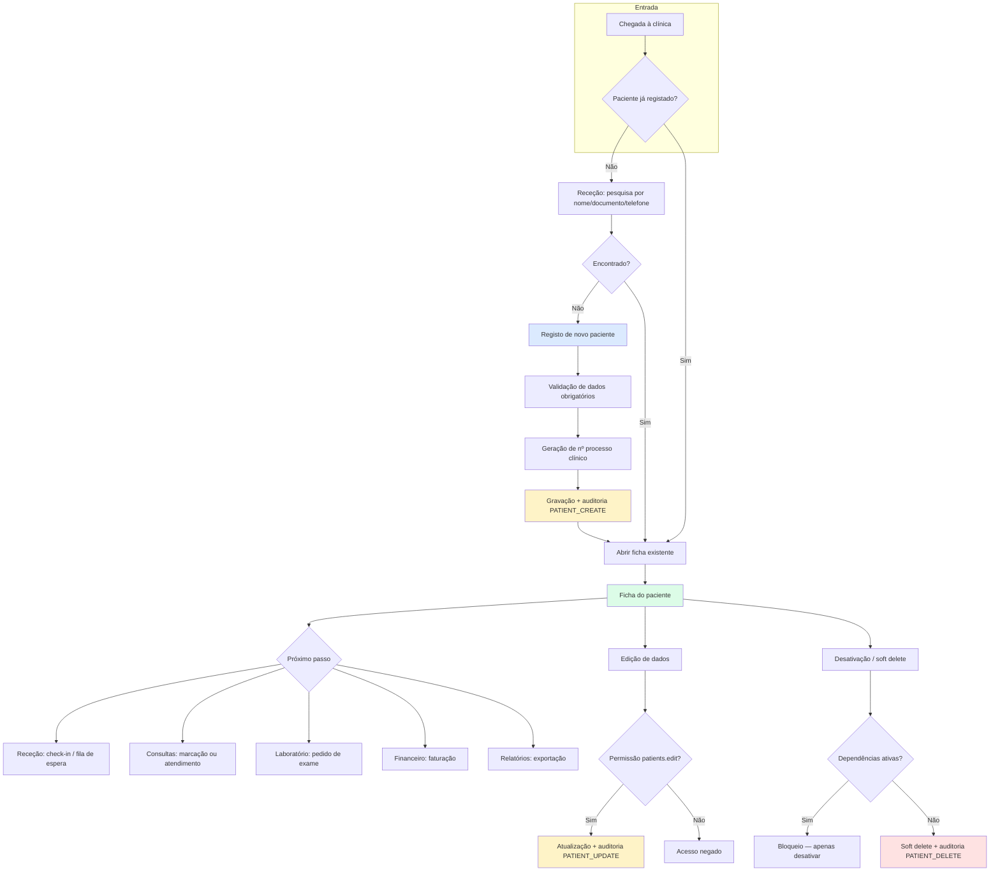
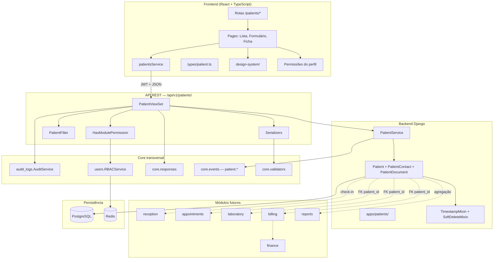

# Módulo de Gestão de Pacientes — SGCS

Documentação técnica da **Sprint 4** do Sistema de Gestão Clínica SauVida (SGCS).

> **Estado:** Implementado (Sprint 4) — backend, frontend e integração com o SGCS.

## Índice da documentação

| Documento | Conteúdo |
|-----------|----------|
| [Especificação Funcional](./Especificacao-Funcional.md) | Visão geral, objetivos, regras de negócio, fluxo, casos de uso, user stories, critérios de aceitação |
| [Arquitetura Técnica](./Arquitetura-Tecnica.md) | Estrutura das APIs, frontend e backend |
| [Modelo de Dados](./Database.md) | Entidades, campos, constraints, índices, FKs, diagrama ER |
| [API REST](./API.md) | Endpoints, requests, responses, paginação, filtros, erros, exemplos JSON |
| [Interface (UI)](./UI.md) | Wireframes, componentes, formulários, modais, Design System |
| [Segurança e Integrações](./Seguranca-Auditoria-Integracoes.md) | Auditoria, RBAC, integrações futuras |

## Contexto no SGCS

O módulo de Pacientes é a **entidade central** do ecossistema clínico. Todos os módulos downstream — Receção, Consultas, Laboratório, Financeiro e Relatórios — dependem de um registo de paciente consistente, auditável e governado por RBAC.

### Estado atual do projeto (Sprint 4)

| Camada | Estado |
|--------|--------|
| `backend/apps/patients/` | **Implementado** — models, services, API REST, signals, testes |
| RBAC | Permissões `patients.*` semeadas via `seed_rbac` (Docker entrypoint) |
| Frontend | `features/patients/` — 6 páginas, design system, React Hook Form + Zod |
| Rotas API | `/api/v1/patients/` montada em `config/urls.py` |
| Dashboard | KPIs clínicos em `/api/v1/dashboard/clinical/` |
| Auditoria | Ações `PATIENT_*` + trail por paciente |
| Docker | `seed_rbac` no entrypoint; healthcheck do backend em `/ready/` |

### Princípios arquiteturais herdados

- API envelope: `{ success, message, data }`
- Paginação: 20 itens/página (`StandardPagination`)
- Permissões: `HasModulePermission` + codenames `{módulo}.{ação}`
- Auditoria: `AuditService.log()` em todas as mutações
- Soft delete: padrão `SoftDeleteMixin` (como `User`)
- UI em português, datas `DD/MM/AAAA`, moeda FCFA (XOF)
- Timezone: `Africa/Bissau`

---

## Diagrama — Fluxo do Paciente

---

## Diagrama — Arquitetura do Módulo

---

## Roadmap do Módulo

### Fase 1 — Fundação (Sprint 4.1)

| Entrega | Descrição | Prioridade |
|---------|-----------|------------|
| Modelo `Patient` | Dados demográficos, contacto, identificação, soft delete | Alta |
| CRUD API | Listagem, detalhe, criar, editar, desativar | Alta |
| RBAC | Integração `patients.view/create/edit/delete` | Alta |
| Auditoria | Ações `PATIENT_*` no `AuditLog` | Alta |
| Frontend — Lista | Pesquisa, filtros, paginação | Alta |
| Frontend — Formulário | Criar/editar com validação Zod | Alta |
| Montagem URL | `path("api/v1/patients/", ...)` | Alta |

### Fase 2 — Ficha clínica base (Sprint 4.2)

| Entrega | Descrição | Prioridade |
|---------|-----------|------------|
| Ficha de detalhe | Vista consolidada do paciente | Alta |
| Contacto de emergência | Modelo `PatientEmergencyContact` | Média |
| Histórico de alterações | Timeline na ficha (via audit logs) | Média |
| Impressão de ficha | `patients.print` | Média |
| Exportação CSV/PDF | `patients.export` | Média |

### Fase 3 — Documentos e anexos (Sprint 4.3)

| Entrega | Descrição | Prioridade |
|---------|-----------|------------|
| Integração `apps/files` | Upload de BI, seguro, consentimentos | Média |
| Galeria de documentos | Na ficha do paciente | Média |
| Validação de duplicados | Por `document_number` | Alta |

### Fase 4 — Integrações clínicas (Sprint 4.4+)

| Entrega | Descrição | Prioridade |
|---------|-----------|------------|
| Receção | Check-in, fila de espera, ligação ao paciente | Alta |
| Consultas | Marcações e episódios clínicos | Alta |
| Laboratório | Pedidos de exame por paciente | Média |
| Financeiro | Conta corrente / faturação | Média |
| Relatórios | Estatísticas demográficas, listagens | Baixa |
| Event bus | `patient.created`, `patient.updated` | Baixa |

### Fase 5 — Migração frontend (contínua)

| Entrega | Descrição |
|---------|-----------|
| `features/patients/` | Migrar páginas de `pages/` para feature folder |
| Design system | Adotar `@/design-system` em todos os ecrãs novos |
| Guards de rota | Proteção por `patients.view` no router |

### Critérios de conclusão da Sprint 4

- [ ] Paciente pode ser registado, consultado, editado e desativado
- [ ] Permissões RBAC respeitadas em todos os endpoints
- [ ] Todas as mutações auditadas
- [ ] Frontend funcional com listagem e formulário
- [ ] Testes automatizados (backend + smoke frontend)
- [ ] Documentação OpenAPI atualizada no Swagger
- [ ] Nenhuma regressão nos módulos existentes (auth, users, dashboard)

---

## Convenções do módulo

| Área | Convenção |
|------|-----------|
| App Django | `apps.patients`, label `patients` |
| URL base | `/api/v1/patients/` |
| Codenames RBAC | `patients.view`, `patients.create`, `patients.edit`, `patients.delete`, `patients.export`, `patients.print`, `patients.admin` |
| Audit actions | `PATIENT_CREATE`, `PATIENT_UPDATE`, `PATIENT_DELETE`, `PATIENT_ACTIVATE`, `PATIENT_DEACTIVATE`, `PATIENT_VIEW` (acesso sensível) |
| Audit resource_type | `patient` |
| Eventos | `patient.created`, `patient.updated`, `patient.deactivated` |
| Rotas frontend | `/patients`, `/patients/new`, `/patients/:id`, `/patients/:id/edit` |
| React Query keys | `["patients", ...]`, `["patient", id]` |

---

## Referências internas

- [Arquitetura geral do SGCS](../Arquitetura.md)
- Módulo de referência: `backend/apps/users/`
- RBAC: `backend/apps/users/management/commands/seed_rbac.py`
- Tipos frontend: `frontend/src/types/patient.ts`
