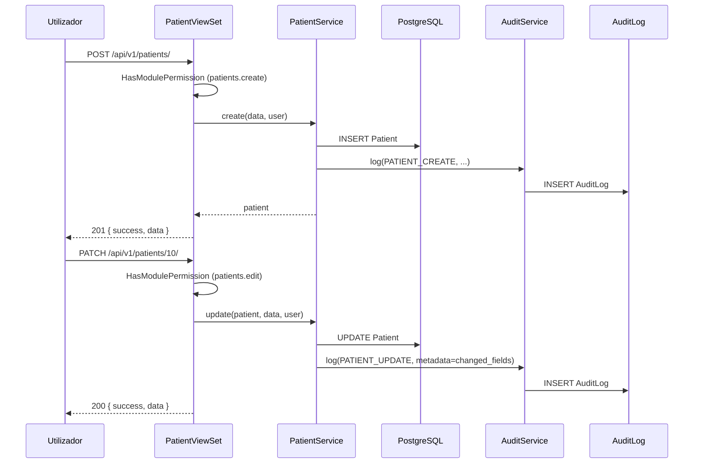
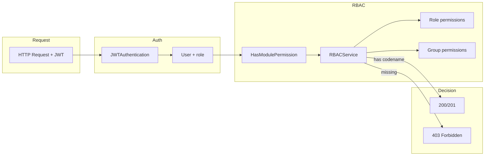
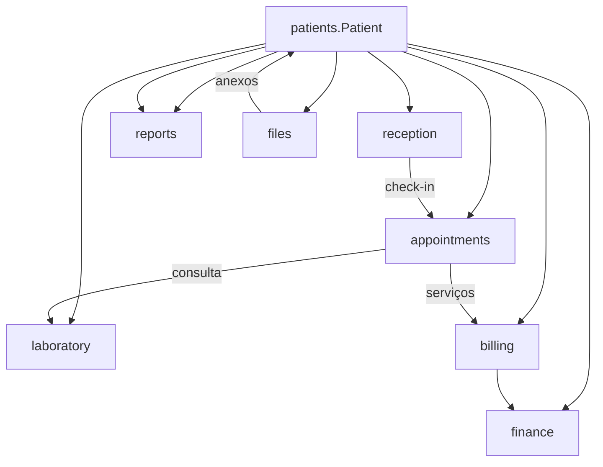

# Segurança, Auditoria e Integrações — Módulo de Pacientes

**Projeto:** SGCS  
**Sprint:** 4  
**Versão:** 1.0

---

## 11. Fluxo de Auditoria

### 11.1 Princípio

Toda operação que **crie, altere, desative ou exporte** dados de pacientes deve ser registada no módulo `audit_logs`, seguindo o padrão já implementado em `apps/users/views.py` com `AuditService.log()`.

### 11.2 Novas ações de auditoria

Extensão planeada do enum `AuditAction` em `apps/audit_logs/models.py`:

| Ação | Gatilho | Descrição |
|------|---------|-----------|
| `PATIENT_CREATE` | `POST /patients/` | Registo de novo paciente |
| `PATIENT_UPDATE` | `PATCH /patients/{id}/` | Alteração de dados |
| `PATIENT_DELETE` | `DELETE /patients/{id}/` | Soft delete |
| `PATIENT_ACTIVATE` | `POST .../activate/` | Reativação |
| `PATIENT_DEACTIVATE` | `POST .../deactivate/` | Desativação |
| `PATIENT_EXPORT` | `GET .../export/` | Exportação de listagem |
| `PATIENT_PRINT` | `GET .../print/` | Impressão de ficha |
| `PATIENT_VIEW_SENSITIVE` | `GET .../{id}/` (opcional) | Acesso a dados sensíveis |

### 11.3 Estrutura do registo

```python
AuditService.log(
    action=AuditAction.PATIENT_CREATE,
    description=f"Paciente {patient.full_name} registado (nº {patient.patient_number}).",
    user=request.user,
    request=request,
    resource_type="patient",
    resource_id=str(patient.id),
    metadata={
        "patient_number": patient.patient_number,
        "document_number": patient.document_number,
        "changed_fields": ["phone", "address"],  # em updates
    },
)
```

### 11.4 Diagrama do fluxo de auditoria



### 11.5 Consulta do histórico

Endpoint dedicado na ficha do paciente:

```
GET /api/v1/patients/{id}/audit-trail/
```

Implementação: filtrar `AuditLog` por `resource_type="patient"` e `resource_id={id}`, ordenado por `-created_at`.

Alternativa: reutilizar `GET /api/v1/audit-logs/?resource_type=patient&resource_id={id}` (requer extensão de filtros no módulo audit).

### 11.6 Retenção e conformidade

| Aspeto | Decisão |
|--------|---------|
| Retenção | Indefinida (dados clínicos) |
| Imutabilidade | Registos de auditoria nunca são editados ou eliminados |
| IP e User-Agent | Capturados automaticamente via `get_client_info(request)` |
| Dados em metadata | Apenas identificadores e nomes de campos — sem valores clínicos sensíveis em metadata |

---

## 12. Permissões RBAC

### 12.1 Codenames existentes

O comando `seed_rbac` já cria 7 permissões para o módulo `patients`:

| Codename | Ação | Descrição |
|----------|------|-----------|
| `patients.view` | view | Consultar listagem e ficha |
| `patients.create` | create | Registar novos pacientes |
| `patients.edit` | edit | Editar dados existentes |
| `patients.delete` | delete | Desativar / soft delete |
| `patients.export` | export | Exportar listagens |
| `patients.print` | print | Imprimir ficha |
| `patients.admin` | admin | Operações administrativas avançadas |

### 12.2 Matriz perfil × permissão (padrão seed)

| Perfil | view | create | edit | delete | export | print | admin |
|--------|:----:|:------:|:----:|:------:|:------:|:-----:|:-----:|
| **ADMINISTRADOR** | ✅ | ✅ | ✅ | ✅ | ✅ | ✅ | ✅ |
| **RECECIONISTA** | ✅ | ✅ | ✅ | ❌ | ❌ | ❌ | ❌ |
| **MEDICO** | ✅ | ❌ | ✅ | ❌ | ❌ | ❌ | ❌ |
| **ENFERMEIRO** | ✅ | ❌ | ❌ | ❌ | ❌ | ❌ | ❌ |
| **LABORATORIO** | ✅ | ❌ | ❌ | ❌ | ❌ | ❌ | ❌ |
| **FINANCEIRO** | ✅ | ❌ | ❌ | ❌ | ❌ | ❌ | ❌ |

> Grupos de utilizadores (`UserGroup`) podem conceder permissões adicionais sem alterar o perfil base.

### 12.3 Mapeamento ação API → permissão

| Ação ViewSet | `required_permission` |
|--------------|----------------------|
| `list` | `patients.view` |
| `retrieve` | `patients.view` |
| `create` | `patients.create` |
| `update` / `partial_update` | `patients.edit` |
| `destroy` | `patients.delete` |
| `activate` | `patients.edit` |
| `deactivate` | `patients.delete` |
| `export` | `patients.export` |
| `print` | `patients.print` |
| `check_duplicate` | `patients.create` |
| `audit_trail` | `patients.view` |

### 12.4 Implementação backend

```python
from apps.users.permissions import HasModulePermission

class PatientViewSet(viewsets.ModelViewSet):
    def get_permissions(self):
        return [HasModulePermission()]

    @property
    def required_permission(self) -> str:
        permission_map = {
            "list": "patients.view",
            "retrieve": "patients.view",
            "create": "patients.create",
            "update": "patients.edit",
            "partial_update": "patients.edit",
            "destroy": "patients.delete",
            # custom actions...
        }
        return permission_map.get(self.action, "patients.view")
```

Bypass automático para `superuser` e perfil `ADMINISTRADOR` (via `RBACService`).

### 12.5 Implementação frontend

#### Obtenção de permissões

O perfil do utilizador (`GET /api/v1/users/profile/`) devolve lista `permissions: string[]`.

#### Controlo de UI

```typescript
const { data: profile } = useQuery({ queryKey: ["profile"], ... });
const canCreate = profile?.permissions.includes("patients.create");
const canEdit = profile?.permissions.includes("patients.edit");

// Ocultar botões conforme permissão
{canCreate && <Button onClick={() => navigate("/patients/new")}>Novo paciente</Button>}
```

#### Guards de rota (Sprint 4.2)

Componente `PermissionRoute` planeado:

```typescript
<Route
  path="patients/new"
  element={
    <PermissionRoute permission="patients.create">
      <PatientFormPage />
    </PermissionRoute>
  }
/>
```

### 12.6 Diagrama RBAC



---

## 13. Integração futura com outros módulos

### 13.1 Visão de dependências



### 13.2 Receção (`apps/reception`)

| Aspeto | Integração |
|--------|------------|
| **Dependência** | FK `patient_id` → `Patient` |
| **Fluxo** | Check-in na chegada → confirma presença → encaminha para fila |
| **Dados partilhados** | `patient_number`, `full_name`, `phone` |
| **Permissões** | Rececionista já tem `patients.view/create/edit` |
| **UI** | Botão "Check-in" na ficha do paciente (Sprint 5) |
| **Nota** | `reception` não está no enum `SystemModule` — adicionar em sprint futura ou mapear para `appointments` |

**Contrato futuro:**

```
POST /api/v1/reception/check-in/
{ "patient_id": 42, "service_type": "consulta", "notes": "" }
```

### 13.3 Consultas (`apps/appointments`)

| Aspeto | Integração |
|--------|------------|
| **Dependência** | FK `patient_id` → `Patient` (já previsto em `types/appointment.ts`) |
| **Fluxo** | Da ficha → "Nova consulta" → formulário pré-preenchido |
| **Regra** | Paciente inativo não pode ter novas marcações (RN-09) |
| **Permissões** | `appointments.create` + `patients.view` |
| **Dados na ficha** | Lista de consultas recentes e próximas |

**Contrato futuro:**

```
GET /api/v1/patients/{id}/appointments/
POST /api/v1/appointments/ { "patient_id": 42, "doctor_id": 5, "scheduled_at": "..." }
```

**Endpoint agregado no módulo patients (opcional):**

```
GET /api/v1/patients/{id}/appointments/  → proxy para appointments filtrado
```

### 13.4 Laboratório (`apps/laboratory`)

| Aspeto | Integração |
|--------|------------|
| **Dependência** | FK `patient_id` → `Patient` em pedidos de exame |
| **Fluxo** | Da ficha → "Novo exame" → seleção de painel |
| **Dados partilhados** | Nome, idade (calculada de `birth_date`), género, alergias (`notes`) |
| **Permissões** | `laboratory.create` + `patients.view` |
| **UI** | Secção "Exames" na ficha com estados: pedido, em curso, concluído |

**Contrato futuro:**

```
GET /api/v1/patients/{id}/lab-orders/
POST /api/v1/laboratory/orders/ { "patient_id": 42, "tests": ["hemograma"] }
```

### 13.5 Financeiro (`apps/billing` + `apps/finance`)

| Aspeto | Integração |
|--------|------------|
| **Dependência** | FK `patient_id` → `Patient` em faturas e movimentos |
| **Fluxo** | Da ficha → "Conta corrente" → faturas pendentes |
| **Dados partilhados** | Identificação fiscal, contacto para recibos |
| **Permissões** | `billing.view` + `patients.view` (Financeiro já tem ambos no seed) |
| **Regra** | Desativação de paciente não elimina histórico financeiro |

**Contrato futuro:**

```
GET /api/v1/patients/{id}/invoices/
GET /api/v1/patients/{id}/balance/
```

### 13.6 Relatórios (`apps/reports`)

| Aspeto | Integração |
|--------|------------|
| **Dependência** | Agregação sobre `Patient` (sem FK inverso) |
| **Relatórios planeados** | Novos pacientes por período, distribuição por género/idade, taxa de retorno |
| **Permissões** | `reports.view`, `reports.export` |
| **Fonte de dados** | Querysets read-only sobre `Patient` |

**Contratos futuros:**

```
GET /api/v1/reports/patients/summary/?from=01/01/2026&to=31/01/2026
GET /api/v1/reports/patients/demographics/
```

### 13.7 Ficheiros (`apps/files` — Sprint 3.5)

| Aspeto | Integração |
|--------|------------|
| **Dependência** | `StoredFile` com FK opcional `patient_id` (a adicionar) |
| **Uso** | Upload de BI digitalizado, consentimentos, resultados externos |
| **Serviço** | `FileStorageService` em `apps/files/services/` |
| **UI** | Galeria de documentos na ficha (Sprint 4.3) |

### 13.8 Event bus (`core/events`)

Publicação de eventos para desacoplamento (Sprint 4.4):

| Evento | Payload | Subscritores futuros |
|--------|---------|---------------------|
| `patient.created` | `{ patient_id, patient_number }` | analytics, notifications |
| `patient.updated` | `{ patient_id, changed_fields }` | audit (redundante), cache invalidation |
| `patient.deactivated` | `{ patient_id }` | appointments (cancelar pendentes) |

```python
from core.events import event_bus, EventNames

event_bus.publish(EventNames.PATIENT_CREATED, {
    "patient_id": patient.id,
    "patient_number": patient.patient_number,
})
```

> Nota: adicionar `PATIENT_CREATED`, `PATIENT_UPDATED`, `PATIENT_DEACTIVATED` a `EventNames` em implementação.

### 13.9 Analytics (`apps/analytics`)

| Aspeto | Integração |
|--------|------------|
| **Registo** | `AnalyticsService.record_event("patient.registered", {...})` |
| **Métricas** | Total de pacientes ativos, registos por dia/semana |
| **Dashboard** | Widget no dashboard admin (Sprint futura) |

### 13.10 Matriz de integração por sprint

| Módulo | Sprint prevista | Tipo de ligação | Bloqueante para patients? |
|--------|---------------|-----------------|---------------------------|
| **Receção** | 5 | FK + check-in | Não |
| **Consultas** | 5 | FK + UI na ficha | Não |
| **Laboratório** | 6 | FK + pedidos | Não |
| **Faturação** | 6 | FK + conta corrente | Não |
| **Financeiro** | 7 | Agregação billing | Não |
| **Relatórios** | 7 | Queries read-only | Não |
| **Ficheiros** | 4.3 | FK + upload | Não |
| **Event bus** | 4.4 | Pub/sub | Não |

### 13.11 Preparação no módulo patients (design)

Para facilitar integrações sem retrabalho:

1. **FK estável**: `Patient.id` como referência única em todos os módulos.
2. **Identificador legível**: `patient_number` para exibição humana em documentos e UI.
3. **Endpoints de agregação**: stubs na ficha (`/patients/{id}/appointments/`) que retornam `[]` até módulos existirem.
4. **Flags de dependência**: `PatientService.can_delete()` verifica consultas/faturas ativas via interfaces, não imports diretos (evitar acoplamento circular).
5. **Secções placeholder no frontend**: cards "Consultas", "Exames", "Faturas" com estado "Em breve" na ficha.

### 13.12 Interfaces de desacoplamento (backend)

```python
# apps/patients/services/dependency_service.py

class PatientDependencyService:
    """Verifica dependências cross-module sem acoplamento direto."""

    @staticmethod
    def has_active_appointments(patient_id: int) -> bool:
        # Implementação quando appointments existir
        # try: return Appointment.objects.filter(patient_id=..., status=ACTIVE).exists()
        return False  # stub Sprint 4

    @staticmethod
    def has_pending_invoices(patient_id: int) -> bool:
        return False  # stub Sprint 4
```

---

## Resumo de decisões de segurança

| Decisão | Justificação |
|---------|--------------|
| Soft delete obrigatório | Integridade referencial e histórico clínico |
| RBAC por codename | Consistência com módulo users |
| Auditoria em todas as mutações | Conformidade e responsabilização |
| Dados sensíveis em JSON (morada) | Flexibilidade sem migrações frequentes |
| Sem endpoints públicos | Todos requerem JWT |
| Duplicados como alerta, não bloqueio absoluto | Urgências clínicas (RN-04) |
| Perfis read-only para lab/financeiro | Princípio do menor privilégio |
