# Interface do Módulo de Pacientes — SGCS

**Projeto:** SGCS — Sistema de Gestão Clínica SauVida  
**Sprint:** 4  
**Versão:** 1.0  
**Estado:** Especificação UI — **sem implementação React**

> Referências: [API.md](./API.md) · [Database.md](./Database.md) · Design System em `frontend/src/design-system/`

---

## Índice

1. [Princípios de interface](#1-princípios-de-interface)
2. [Rotas e navegação](#2-rotas-e-navegação)
3. [Design System — mapeamento](#3-design-system--mapeamento)
4. [Lista de Pacientes](#4-lista-de-pacientes)
5. [Novo Paciente](#5-novo-paciente)
6. [Editar Paciente](#6-editar-paciente)
7. [Detalhes do Paciente](#7-detalhes-do-paciente)
8. [Ficha Clínica](#8-ficha-clínica)
9. [Documentos](#9-documentos)
10. [Histórico](#10-histórico)
11. [Componentes partilhados](#11-componentes-partilhados)
12. [Permissões na UI](#12-permissões-na-ui)

---

## 1. Princípios de interface

| Princípio | Aplicação |
|-----------|-----------|
| **Layout** | `AppLayout` — módulo clínico (não `AdminLayout`) |
| **Design System** | Todos os ecrãs novos importam de `@/design-system` |
| **Idioma** | Português em labels, mensagens e botões |
| **Datas** | Exibição `DD/MM/AAAA`; inputs com máscara ou date picker |
| **Feedback** | `Toast` para sucesso/erro; `LoadingState` / `ErrorState` / `EmptyState` |
| **Responsivo** | Mobile-first; tabelas com scroll horizontal em ecrãs pequenos |
| **Acessibilidade** | Labels em todos os `Input`; botões com texto descritivo |
| **Permissões** | Botões e rotas ocultos conforme `permissions[]` do perfil |

### Hierarquia visual

```
AppHeader (global)
└── main (max-w-7xl)
    ├── Cabeçalho da página (título + subtítulo + ações)
    ├── Barra de filtros / pesquisa (quando aplicável)
    ├── Conteúdo principal (Card / Table / Form)
    └── Paginação / rodapé de ações
```

---

## 2. Rotas e navegação

### Mapa de rotas

| Rota | Página | Permissão mínima |
|------|--------|------------------|
| `/patients` | Lista de Pacientes | `patients.view` |
| `/patients/new` | Novo Paciente | `patients.create` |
| `/patients/:id` | Detalhes (resumo) | `patients.view` |
| `/patients/:id/edit` | Editar Paciente | `patients.edit` |
| `/patients/:id/clinical` | Ficha Clínica | `patients.view` |
| `/patients/:id/documents` | Documentos | `patients.view` |
| `/patients/:id/history` | Histórico | `patients.view` |

### Navegação global

Link **"Pacientes"** no `AppHeader`, visível quando `permissions.includes("patients.view")`.

### Navegação contextual (ficha do paciente)

Sub-navegação horizontal em todas as páginas de detalhe:

```
[ Resumo ]  [ Ficha Clínica ]  [ Documentos ]  [ Histórico ]
```

### Fluxo de navegação

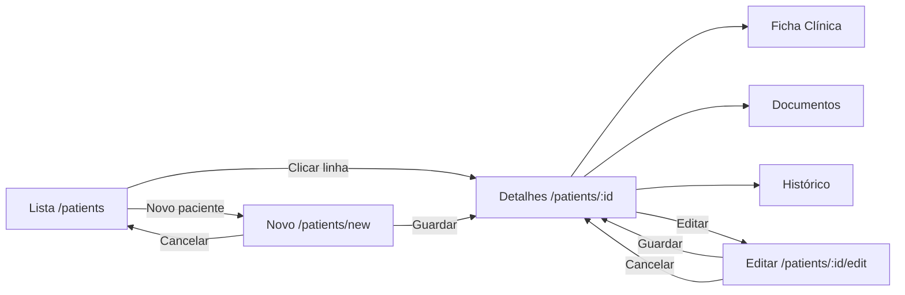

---

## 3. Design System — mapeamento

| Necessidade UI | Componente `@/design-system` |
|----------------|------------------------------|
| Ações primárias | `Button` variant `primary` |
| Ações secundárias | `Button` variant `secondary` / `outline` |
| Cancelar / voltar | `Button` variant `ghost` |
| Eliminar / desativar | `Button` variant `danger` |
| Campos de formulário | `Input` (label + error) |
| Contentores | `Card` (title, description, footer) |
| Listagens | `Table` + `getRowKey` |
| Estado ativo/inativo | `Badge` variant `success` / `default` |
| Alertas clínicos | `Badge` variant `danger` / `warning` |
| Foto do paciente | `Avatar` |
| Confirmações | `Modal` |
| Notificações | `Toast` / `useToast` |
| Paginação | `Pagination` *(ou prev/next API — ver nota)* |
| Lista vazia | `EmptyState` |
| Carregamento | `LoadingState` |
| Falha de rede | `ErrorState` |

> **Nota paginação:** A API devolve `next`/`previous` (padrão users). A lista pode usar botões Anterior/Seguinte ou calcular `totalPages` a partir de `count / page_size` para o componente `Pagination`.

### Componentes locais (a criar na implementação)

| Componente | Pasta | Função |
|------------|-------|--------|
| `PatientSubNav` | `features/patients/components/` | Tabs Resumo / Clínica / Documentos / Histórico |
| `PatientHeader` | `features/patients/components/` | Avatar + nome + nº processo + badges |
| `PatientFilters` | `features/patients/components/` | Filtros da listagem |
| `DuplicateAlert` | `features/patients/components/` | Alerta de possíveis duplicados |
| `AllergyAlertBanner` | `features/patients/components/` | Banner vermelho se alergias graves |
| `EmergencyContactForm` | `features/patients/components/` | Sub-formulário de contactos |
| `DocumentUploadModal` | `features/patients/components/` | Modal de upload |

---

## 4. Lista de Pacientes

**Rota:** `/patients`  
**API:** `GET /api/v1/patients/`

### Wireframe

```mermaid
flowchart TB
    subgraph PAGE["Lista de Pacientes"]
        subgraph HDR["Cabeçalho"]
            T["h2: Pacientes"]
            ST["subtítulo: Gestão de utentes da clínica"]
            BTN_NEW["Button primary: + Novo Paciente"]
        end

        subgraph FILTERS["Card — Filtros"]
            SRCH["Input: Pesquisar nome, doc., telefone, nº processo"]
            F1["select: Estado — Todos / Ativos / Inativos"]
            F2["select: Sexo — Todos / M / F / O"]
            F3["Button outline: Limpar filtros"]
        end

        subgraph TABLE["Card — Tabela"]
            TB["Table"]
            C1["Col: Nº Processo"]
            C2["Col: Nome"]
            C3["Col: Telefone"]
            C4["Col: Documento"]
            C5["Col: Nascimento"]
            C6["Col: Estado — Badge"]
            C7["Col: Ações"]
        end

        subgraph FOOT["Rodapé"]
            INFO["Texto: X pacientes encontrados"]
            PAG["Pagination ou Anterior / Seguinte"]
        end
    end

    HDR --> FILTERS --> TABLE --> FOOT
```

### Componentes

| Zona | Componentes Design System |
|------|---------------------------|
| Cabeçalho | `Button` |
| Filtros | `Card`, `Input`, `Button` |
| Tabela | `Card`, `Table`, `Badge` |
| Estados | `LoadingState`, `EmptyState`, `ErrorState` |
| Feedback | `Toast` (após ações em linha) |

### Botões

| Botão | Variant | Visível se | Ação |
|-------|---------|------------|------|
| Novo Paciente | `primary` | `patients.create` | Navega → `/patients/new` |
| Limpar filtros | `outline` | sempre | Reset filtros + `page=1` |
| Ver ficha | `ghost` | `patients.view` | Navega → `/patients/:id` |
| Editar | `outline` | `patients.edit` | Navega → `/patients/:id/edit` |
| Desativar | `danger` | `patients.delete` | Abre `Modal` confirmação |
| Exportar | `secondary` | `patients.export` | `GET .../export/` |

### Tabela — colunas

| Coluna | Campo | Render |
|--------|-------|--------|
| Nº Processo | `patient_number` | texto mono |
| Nome | `full_name` | link → detalhe |
| Telefone | `phone` | texto |
| Documento | `document_number` | texto ou "—" |
| Nascimento | `birth_date` | data formatada |
| Estado | `is_active` | `Badge` success/default |
| Ações | — | botões inline |

### Pesquisa e filtros

| Controlo | Parâmetro API | Debounce |
|----------|---------------|----------|
| Input pesquisa | `search` | 300 ms |
| Estado | `is_active` | imediato |
| Sexo | `gender` | imediato |

**React Query key:** `["patients", page, search, is_active, gender]`

### Paginação

- `page` e `page_size` (default 20)
- Exibir: "A mostrar 1–20 de 150"
- `Pagination` com `totalPages = Math.ceil(count / page_size)` ou botões prev/next

### Alertas

| Tipo | Quando | Componente |
|------|--------|------------|
| Lista vazia | `count === 0` sem filtros | `EmptyState` + CTA "Registar primeiro paciente" |
| Sem resultados | `count === 0` com filtros | `EmptyState` "Nenhum paciente encontrado" |
| Erro API | query error | `ErrorState` + "Tentar novamente" |

### Modais

| Modal | Gatilho | Conteúdo |
|-------|---------|----------|
| Confirmar desativação | Botão Desativar | "Deseja desativar {nome}?" — Confirmar / Cancelar |
| Confirmar exportação | Botão Exportar | Formato CSV/XLSX *(Sprint 4.2)* |

---

## 5. Novo Paciente

**Rota:** `/patients/new`  
**API:** `POST /api/v1/patients/` + `GET .../check-duplicate/`

### Wireframe

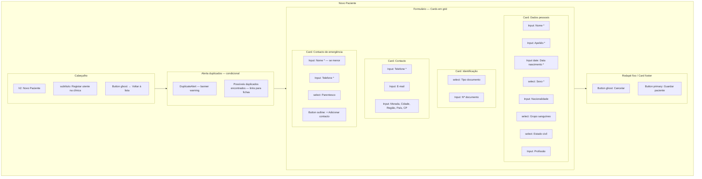

### Componentes

| Zona | Componentes |
|------|-------------|
| Formulário | `Card`, `Input`, `Button` |
| Validação | `Input` prop `error` |
| Duplicados | `DuplicateAlert` (custom) + `Badge` |
| Submit | `Button` `isLoading` |
| Sucesso | `Toast` variant `success` |

### Formulário — secções e campos

| Secção | Campos | Obrigatório |
|--------|--------|:-----------:|
| Dados pessoais | first_name, last_name, birth_date, gender | Sim |
| Identificação | document_type, document_number | Não |
| Contacto | phone, email, address_* | phone Sim |
| Emergência | name, phone, relationship | Se idade < 18 |

### Botões

| Botão | Ação |
|-------|------|
| Voltar / Cancelar | Navega → `/patients` (modal se formulário dirty) |
| Guardar | Valida Zod → `check-duplicate` → `POST` → toast → `/patients/:id` |
| + Adicionar contacto | Adiciona bloco de emergência dinâmico |

### Alertas

| Alerta | Condição | Estilo |
|--------|----------|--------|
| Duplicado detetado | `check-duplicate` matches | Banner `warning` com links |
| Menor sem emergência | validação Zod | `Input` errors + mensagem global |
| Documento duplicado | API 409 | `Toast` variant `error` |

### Modais

| Modal | Gatilho | Ação |
|-------|---------|------|
| Descartar alterações | Cancelar com form dirty | "Alterações não guardadas" |
| Confirmar duplicado | matches + Guardar | "Registar mesmo assim?" |
| Sair com sucesso | — | `Toast` "Paciente registado com sucesso" |

### Validação (Zod — `patientSchema`)

- Telefone: regex SGCS
- Email: opcional, formato válido
- birth_date: não futura
- gender: M | F | O

---

## 6. Editar Paciente

**Rota:** `/patients/:id/edit`  
**API:** `GET /api/v1/patients/{id}/` + `PATCH /api/v1/patients/{id}/`

### Wireframe

```mermaid
flowchart TB
    subgraph PAGE["Editar Paciente"]
        subgraph HDR["PatientHeader compacto"]
            AV["Avatar"]
            NAME["Maria Mendes"]
            NUM["PAC-2026-00001"]
            BADGE["Badge: Ativo"]
        end

        subgraph NAV["PatientSubNav — Resumo ativo em contexto"]
            NAVITEMS["Resumo | Ficha Clínica | Documentos | Histórico"]
        end

        subgraph FORM["Mesma estrutura do Novo Paciente — valores preenchidos"]
            CARDS["Cards: Dados pessoais | Identificação | Contacto | Emergência"]
        end

        subgraph META["Card read-only"]
            RO["patient_number — imutável"]
            CR["Criado em / por"]
            UP["Atualizado em"]
        end

        subgraph ACTIONS["Rodapé"]
            CAN["Button ghost: Cancelar"]
            SAV["Button primary: Guardar alterações"]
        end
    end

    HDR --> NAV --> FORM --> META --> ACTIONS
```

### Diferenças face a Novo Paciente

| Aspeto | Comportamento |
|--------|---------------|
| Dados | Pré-preenchidos via `useQuery(["patient", id])` |
| `patient_number` | Campo read-only (texto cinza) |
| API | `PATCH` em vez de `POST` |
| Cancelar | Volta → `/patients/:id` |
| Sucesso | `Toast` + redirect → `/patients/:id` |
| Emergência | Lista existente + editar/remover contactos |

### Botões adicionais

| Botão | Permissão | Ação |
|-------|-----------|------|
| Desativar paciente | `patients.delete` | `Modal` → `POST .../deactivate/` |
| Reativar | `patients.edit` | `POST .../activate/` |

### Modais

| Modal | Conteúdo |
|-------|----------|
| Desativar paciente | Aviso dependências; Confirmar desativação |
| Remover contacto emergência | Confirmação |

---

## 7. Detalhes do Paciente

**Rota:** `/patients/:id`  
**API:** `GET /api/v1/patients/{id}/`

### Wireframe

```mermaid
flowchart TB
    subgraph PAGE["Detalhes — Resumo"]
        subgraph HDR["PatientHeader"]
            AV["Avatar — foto principal ou iniciais"]
            NAME["h2: Maria Mendes"]
            NUM["PAC-2026-00001"]
            B1["Badge: Ativo"]
            B2["Badge danger: 2 Alergias graves — se aplicável"]
            ACT["Button outline: Editar | Button: Imprimir"]
        end

        subgraph NAV["PatientSubNav"]
            T1["● Resumo"]
            T2["Ficha Clínica"]
            T3["Documentos"]
            T4["Histórico"]
        end

        subgraph GRID["Grid 2 colunas md:"]
            subgraph COL1["Coluna esquerda"]
                C1["Card: Dados pessoais"]
                C2["Card: Identificação"]
                C3["Card: Morada"]
            end
            subgraph COL2["Coluna direita"]
                C4["Card: Contacto"]
                C5["Card: Contactos de emergência"]
                C6["Card: Seguro principal"]
            end
        end

        subgraph QUICK["Cards resumo clínico"]
            QA["Card link: Alergias — 3 ativas → /clinical"]
            QD["Card link: Doenças crónicas — 2 → /clinical"]
            QO["Card link: Última observação → /clinical"]
        end

        subgraph FUTURE["Secções futuras — disabled"]
            F1["Card ghost: Consultas — Em breve"]
            F2["Card ghost: Exames — Em breve"]
            F3["Card ghost: Pagamentos — Em breve"]
        end
    end

    HDR --> NAV --> GRID --> QUICK --> FUTURE
```

### Componentes

| Zona | Componentes |
|------|-------------|
| Cabeçalho | `Avatar`, `Badge`, `Button` |
| Navegação | `PatientSubNav` |
| Dados | `Card` (read-only fields) |
| Resumos | `Card` clicáveis com seta |
| Alergias graves | `AllergyAlertBanner` |

### Botões

| Botão | Permissão | Ação |
|-------|-----------|------|
| Editar | `patients.edit` | → `/patients/:id/edit` |
| Imprimir ficha | `patients.print` | `GET .../print/` nova aba |
| Desativar | `patients.delete` | Modal confirmação |

### Alertas

| Banner | Condição |
|--------|----------|
| Alergias graves | `severity` ∈ {GRAVE, ANAFILAXIA} |
| Paciente inativo | `is_active=false` — `Badge` + banner info |
| Documento pendente | `document_number` vazio — hint amarelo |

### Modais

| Modal | Uso |
|-------|-----|
| Imprimir | Confirmação antes de abrir PDF |
| Desativar | Confirmação com nome do paciente |

---

## 8. Ficha Clínica

**Rota:** `/patients/:id/clinical`  
**API:** allergies, chronic-diseases, observations

### Wireframe

```mermaid
flowchart TB
    subgraph PAGE["Ficha Clínica"]
        HDR["PatientHeader + PatientSubNav — Ficha Clínica ativa"]

        subgraph BANNER["AllergyAlertBanner — sticky top"]
            AL["⚠ Alergia GRAVE: Penicilina — reação anafilática"]
        end

        subgraph TABS["Sub-tabs internas — opcional"]
            TAB1["Alergias"]
            TAB2["Doenças Crónicas"]
            TAB3["Observações"]
        end

        subgraph SEC1["Card: Alergias"]
            H1["h3 + Button: + Nova alergia"]
            T1["Table: Alergénio | Gravidade Badge | Reação | Data | Ações"]
            E1["EmptyState se vazio"]
        end

        subgraph SEC2["Card: Doenças Crónicas"]
            H2["h3 + Button: + Nova doença"]
            T2["Table: Doença | CID | Estado Badge | Diagnóstico | Ações"]
        end

        subgraph SEC3["Card: Observações"]
            H3["h3 + Button: + Nova observação"]
            LIST["Lista de cards — observação com pin, tipo Badge, autor, data"]
            PIN["Observações fixadas no topo"]
        end
    end

    HDR --> BANNER --> TABS --> SEC1 --> SEC2 --> SEC3
```

### Componentes

| Secção | Componentes |
|--------|-------------|
| Alerta | `AllergyAlertBanner` custom + `Badge` danger |
| Alergias | `Card`, `Table`, `Badge`, `Button` |
| Doenças | `Card`, `Table`, `Badge` |
| Observações | `Card`, `Badge`, `Button` |
| Formulários inline | `Modal` com `Input` / textarea |

### Botões

| Botão | Permissão | Ação |
|-------|-----------|------|
| + Nova alergia | `patients.edit` | Modal formulário → `POST .../allergies/` |
| + Nova doença | `patients.edit` | Modal → `POST .../chronic-diseases/` |
| + Nova observação | `patients.edit` | Modal → `POST .../observations/` |
| Editar linha | `patients.edit` | Modal pré-preenchido |
| Desativar registo | `patients.edit` | Modal confirmação |
| Fixar observação | `patients.edit` | `POST .../pin/` |

### Tabelas

**Alergias:**

| Coluna | Badge |
|--------|-------|
| Alergénio | — |
| Gravidade | LEVE=default, MODERADA=warning, GRAVE/ANAFILAXIA=danger |
| Reação | — |
| Desde | diagnosed_at |
| Ações | Editar, Desativar |

**Doenças crónicas:**

| Coluna | Badge |
|--------|-------|
| Doença | — |
| CID | icd_code |
| Estado | ATIVA=danger, CONTROLADA=success, REMISSAO=info |
| Diagnóstico | diagnosed_at |

### Modais — formulários

| Modal | Campos |
|-------|--------|
| Nova alergia | allergen, severity (select), reaction, diagnosed_at, notes |
| Nova doença | disease_name, icd_code, status, diagnosed_at, notes |
| Nova observação | observation_type, content (textarea), is_pinned |

### Alertas

| Tipo | Componente |
|------|------------|
| Alergia grave na ficha | `AllergyAlertBanner` persistente |
| Sem alergias registadas | `EmptyState` "Nenhuma alergia conhecida" |
| Observação fixada | Ícone pin + destaque visual |

---

## 9. Documentos

**Rota:** `/patients/:id/documents`  
**API:** `GET/POST /api/v1/patients/{id}/documents/`

### Wireframe

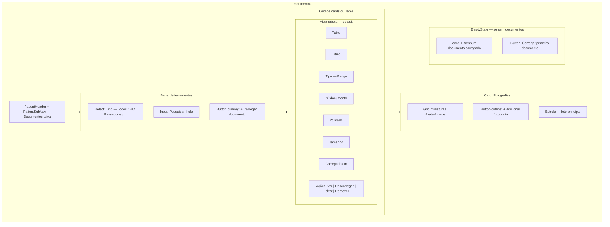

### Componentes

| Zona | Componentes |
|------|-------------|
| Lista | `Table` ou grid de `Card` |
| Tipos | `Badge` |
| Upload | `Modal`, `Input`, `Button` |
| Fotos | `Avatar`, grid de imagens |
| Estados | `EmptyState`, `LoadingState` |

### Botões

| Botão | Permissão | Ação |
|-------|-----------|------|
| Carregar documento | `patients.create` ou `patients.edit` | Abre `DocumentUploadModal` |
| Ver / Descarregar | `patients.view` | Abre `file_url` |
| Editar metadados | `patients.edit` | Modal |
| Remover | `patients.edit` | Modal confirmação |
| Adicionar fotografia | `patients.edit` | Modal upload imagem |
| Definir como principal | `patients.edit` | `POST .../photos/{id}/set-primary/` |

### Filtros e pesquisa

| Controlo | Efeito |
|----------|--------|
| Tipo documento | Filtro client-side ou `document_type` |
| Pesquisa título | Filtro local |

### Modal — upload documento

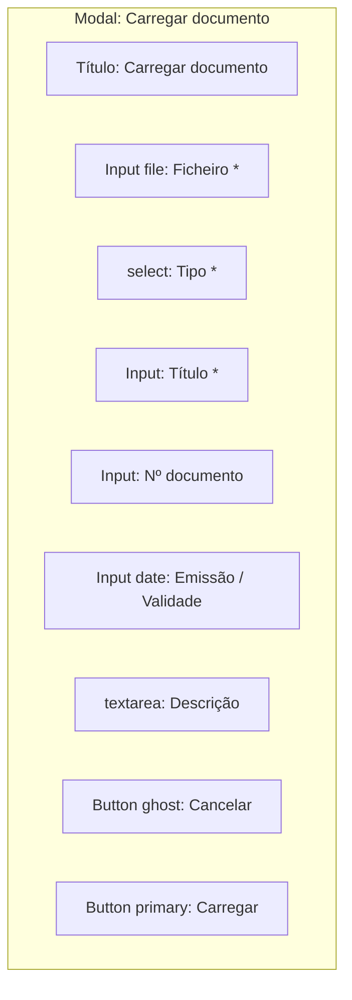

### Alertas

| Alerta | Condição |
|--------|----------|
| Documento a expirar | `expires_at` < 30 dias — `Badge` warning na linha |
| Documento expirado | `Badge` danger |
| Ficheiro demasiado grande | validação client — `Toast` error |

---

## 10. Histórico

**Rota:** `/patients/:id/history`  
**API:** `GET /api/v1/patients/{id}/history/` + `GET .../audit-trail/`

### Wireframe

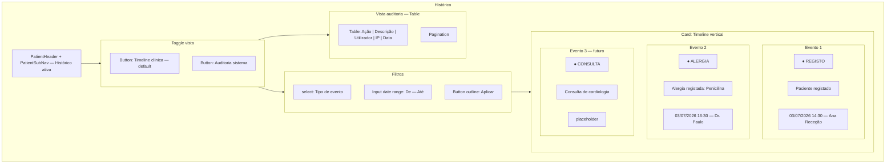

### Componentes

| Vista | Componentes |
|-------|-------------|
| Timeline | `Card`, `Badge` por event_type, lista vertical custom |
| Auditoria | `Table`, `Pagination` |
| Filtros | `Input`, `select`, `Button` |
| Vazio | `EmptyState` |

### Timeline — tipos visuais

| event_type | Cor Badge | Ícone sugerido |
|------------|-----------|----------------|
| REGISTO | info | user-plus |
| ALERGIA | danger | alert |
| DOENCA_CRONICA | warning | heart |
| DOCUMENTO | default | file |
| CONSULTA | success | calendar |
| PAGAMENTO | secondary | currency |

### Botões

| Botão | Ação |
|-------|------|
| Timeline clínica | `GET .../history/` |
| Auditoria sistema | `GET .../audit-trail/` |
| Aplicar filtros | Atualiza query params |
| Ver detalhe evento | Expande `metadata` em painel |

### Paginação

- Timeline: paginação API `page` / `page_size`
- Auditoria: mesma estrutura paginada

### Modais

| Modal | Uso |
|-------|-----|
| Detalhe do evento | Exibe `description` + `metadata` JSON formatado |

---

## 11. Componentes partilhados

### PatientHeader

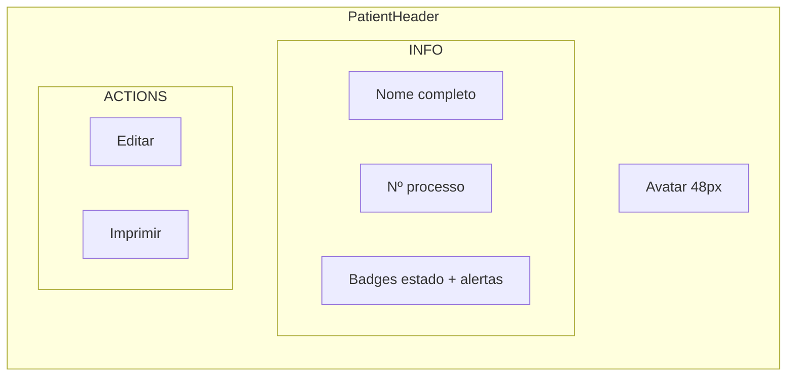

**Props:** `patient`, `onEdit`, `onPrint`, `allergyAlert`

### PatientSubNav

| Tab | Rota | Ativo quando |
|-----|------|--------------|
| Resumo | `/patients/:id` | pathname exact |
| Ficha Clínica | `/patients/:id/clinical` | |
| Documentos | `/patients/:id/documents` | |
| Histórico | `/patients/:id/history` | |

Estilo: igual `AdminLayout` nav — `rounded-xl border bg-white p-2`, link ativo `bg-primary-600 text-white`.

### DuplicateAlert

Banner `warning` abaixo do cabeçalho em Novo Paciente:

- Lista de matches com link → `/patients/:id`
- Botões: "Ver duplicado" | "Continuar mesmo assim"

### AllergyAlertBanner

Banner `danger` no topo da Ficha Clínica e opcionalmente no Detalhes:

- Lista alergias `GRAVE` / `ANAFILAXIA`
- Texto: "Verifique alergias antes de prescrever"

### Layout de formulário padrão

```
grid gap-6 md:grid-cols-2
  Card (full width se necessário)
    grid gap-4 md:grid-cols-2
      Input fields
  Card footer ou barra inferior:
    Button ghost Cancelar | Button primary Guardar
```

---

## 12. Permissões na UI

### Visibilidade de elementos

| Elemento | Permissão |
|----------|-----------|
| Link "Pacientes" no header | `patients.view` |
| Botão Novo Paciente | `patients.create` |
| Botão Editar | `patients.edit` |
| Botão Desativar | `patients.delete` |
| Botão Imprimir | `patients.print` |
| Botão Exportar lista | `patients.export` |
| Formulários clínicos (alergias, etc.) | `patients.edit` |
| Upload documentos | `patients.create` ou `patients.edit` |
| Vista auditoria | `patients.view` |

### Matriz página × ação

| Página | view | create | edit | delete |
|--------|:----:|:------:|:----:|:------:|
| Lista | Ver | Novo | Editar linha | Desativar |
| Novo | — | Guardar | — | — |
| Editar | — | — | Guardar | Desativar |
| Detalhes | Ver tudo | — | Editar | Desativar |
| Ficha Clínica | Ver | — | CRUD clínico | Desativar registo |
| Documentos | Ver/transferir | Upload | Editar meta | Remover |
| Histórico | Ver timeline | — | — | — |

---

## Mapa completo de ecrãs

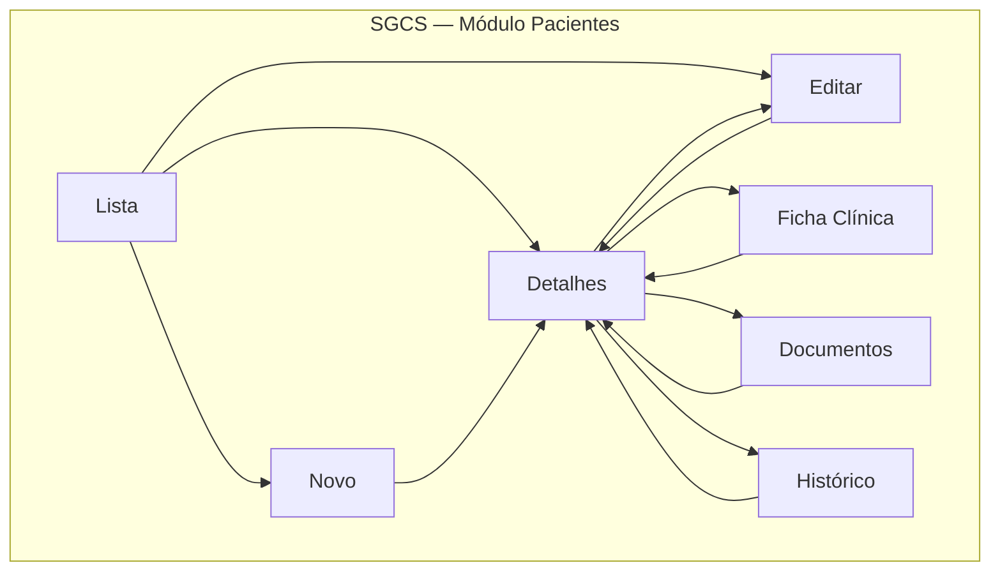

---

## Referências

- [API REST](./API.md)
- [Modelo de dados](./Database.md)
- [Especificação funcional](./Especificacao-Funcional.md)
- Design System: `frontend/src/design-system/`
- Padrão de listagem: `frontend/src/pages/admin/UsersListPage.tsx`
- Rotas planeadas: `frontend/src/features/patients/README.md`
