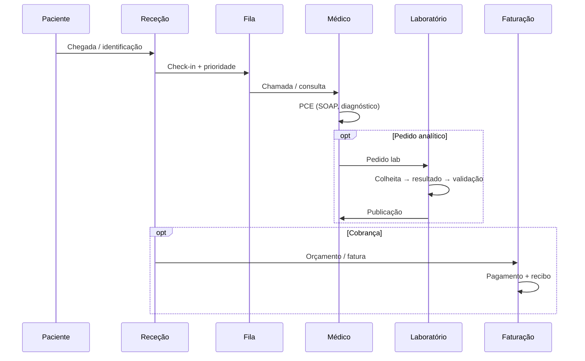
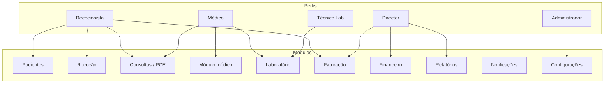
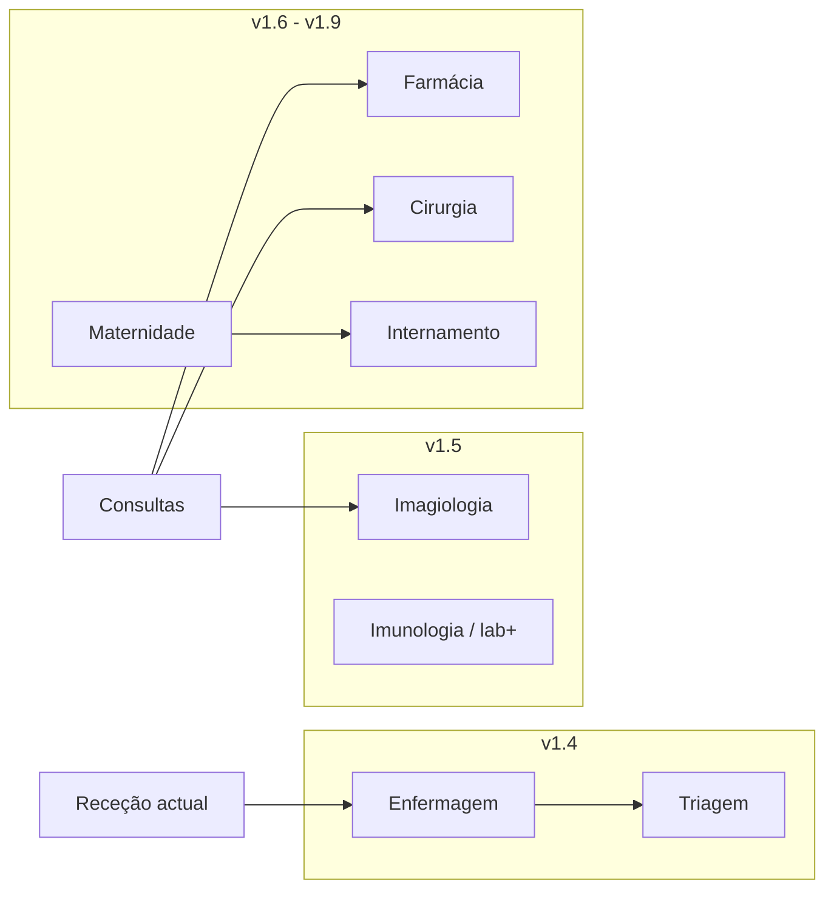
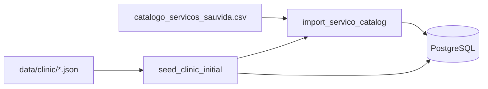

# Diagramas — fluxos clínica vs. SGCS

Ver também [FLUXOS_REAIS_VALIDADOS.md](./FLUXOS_REAIS_VALIDADOS.md).

---

## 1. Jornada do paciente (núcleo actual)

---

## 2. Perfis e módulos SGCS (Sprint 14)

---

## 3. Expansão planeada (não implementada)

---

## 4. Dados de configuração (Sprint 15)

---

*Diagramas em Mermaid — renderizam no GitHub e em editores compatíveis.*
