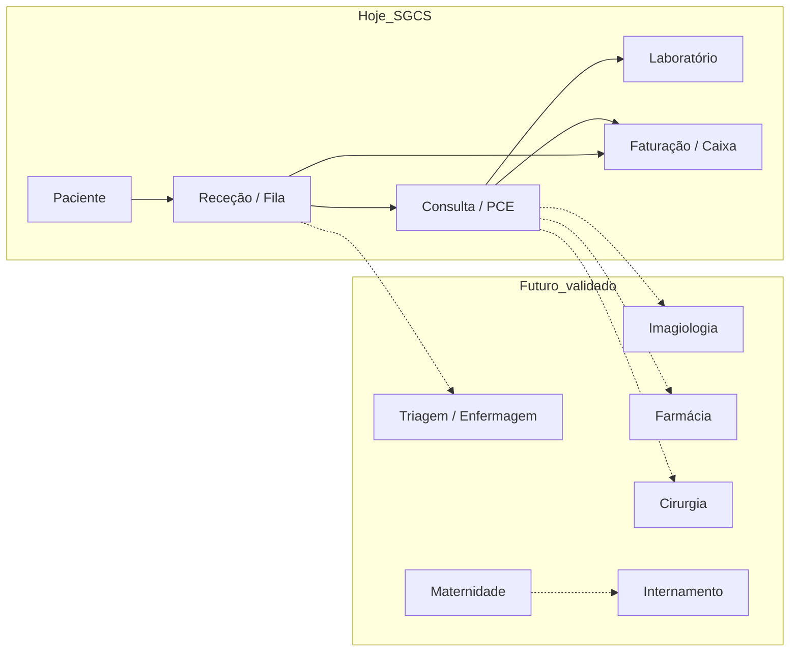

# Fluxos reais validados — Clínica SauVida

**Sprint:** 15  
**Fonte:** Visita presencial + entrevistas (médicos, enfermagem, receção, laboratório)  
**Sistema:** SGCS (estado pós-Sprint 14)

---

## 1. Resumo

A clínica opera como **unidade privada** com fluxo centrado em **receção → fila → consulta → (laboratório / imagiologia / procedimentos) → faturação**. Vários departamentos existem **fisicamente** ou na prática clínica, mas **ainda não têm módulo dedicado** no SGCS. Esta sprint regista o que está coberto hoje e o que fica para versões futuras **após validação documental** (sem implementar Farmácia, Cirurgia ou Maternidade completos).

---

## 2. Fluxos cobertos pelo SGCS (validar em go-live)

| # | Fluxo | Perfis | Estado SGCS | Notas da visita |
|---|--------|--------|-------------|-----------------|
| F1 | Registo e pesquisa de paciente | Receção, Médico | Implementado | Duplicados e histórico — confirmar campos obrigatórios (BI, telefone) |
| F2 | Check-in e fila de espera | Receção | Implementado | Urgências via prioridade na fila; confirmar critérios com receção |
| F3 | Marcação / agenda do dia | Receção, Médico | Implementado | Seguimentos podem ser médico ou receção — definir regra única |
| F4 | Consulta e PCE (SOAP, diagnóstico, prescrição) | Médico | Implementado | Edição pós-conclusão: política a fechar com direcção |
| F5 | Pedido laboratorial na consulta | Médico | Implementado | Integração automática com módulo Lab |
| F6 | Workflow lab (receber → colheita → processar → validar → publicar) | Laboratório | Implementado | Validação antes do médico ver — alinhado com técnico |
| F7 | Orçamento / fatura / pagamento / recibo (FCFA) | Receção, Director | Implementado | Momento do pagamento (antes/depois) — misto na prática |
| F8 | Caixa e movimentos | Director | Implementado | Director assume papel financeiro (sem utilizador FINANCEIRO) |
| F9 | Relatórios e dashboard executivo | Director, Admin | Implementado | Exportações PDF/Excel — validar com contabilidade |
| F10 | Notificações internas | Todos | Implementado | SMS/e-mail lab→médico ainda stub — priorizar canal |
| F11 | Configuração institucional | Admin | Parcial | Dados oficiais (NIF, morada, logótipo) a preencher em `data/clinic/` |

---

## 3. Fluxos identificados na clínica — fora do núcleo actual

| Departamento / fluxo | Prática observada | Cobertura SGCS hoje | Decisão Sprint 15 |
|---------------------|-------------------|---------------------|-------------------|
| **Enfermagem** | Sinais vitais, medicação, curativos, apoio ao médico | Parcial (vitais no PCE; role `ENFERMEIRO` sem UI) | **v1.4** — especificar antes de codificar |
| **Triagem** | Classificação na entrada, prioridade clínica | Parcial (prioridade na fila receção) | **v1.4** — unificar com enfermagem |
| **Farmácia** | Venda/dispensação e stock | Apenas prescrição médica; sem stock | **v1.6** — catálogo de preços em `Servico` (taxas/margens) só |
| **Cirurgia** | Bloco, lista cirúrgica, materiais | Pedido imagiologia genérico; sem bloco | **v1.7** — documentar workflow |
| **Maternidade / Obstetrícia** | Pré-natal, parto, pós-parto | Consultas GO como consulta geral | **v1.8** — não implementar parto no SGCS ainda |
| **Parteira** | Acompanhamento parto | Sem perfil dedicado | **v1.8** — ligado a maternidade |
| **Internamento / camas** | Diárias, alta de internamento | Categoria `INTERNAMENTO` em serviços apenas | **v1.9** — modelo de cama |
| **Imagiologia / Ecografia** | Exames ecográficos dedicados | `POST …/imaging/` no PCE; sem agenda de sala | **v1.5** — fila e laudos |
| **Imunologia / vacinas** | Vacinação e sorologias | Exames lab genéricos | **v1.5** — extensão lab + catálogo |
| **Serviços lab adicionais** | Painel alargado de análises | Lab configurável por tipos de exame | **v1.5** — alinhar catálogo CSV + settings |

---

## 4. Fluxo alvo consolidado (visão)

---

## 5. Regras de negócio a confirmar por escrito (pós-visita)

| ID | Tema | Responsável clínica | Prazo |
|----|------|---------------------|-------|
| RN-01 | Cobrança antes vs. depois da consulta por tipo de serviço | Director | Go-live |
| RN-02 | Quem cancela consultas e com que motivo obrigatório | Director + Receção | Go-live |
| RN-03 | Canal oficial notificação resultado lab | Director + Médicos | Fase 1.3 |
| RN-04 | Lista mínima de exames lab com preço fixo | Lab + Director | Sprint 15 (CSV) |
| RN-05 | Ecografias: agendamento na receção vs. walk-in | Imagiologia | v1.5 |
| RN-06 | Farmácia: preço medicamento vs. taxa de dispensação | Director | v1.6 |

---

## 6. Checklist go-live (actualizar após UAT)

Ver secção 6 em [ENTREVISTAS_FLUXOS_CLINICA.md](../ENTREVISTAS_FLUXOS_CLINICA.md). Marcar data e responsável quando cada fluxo F1–F11 for testado com dados reais e catálogo importado.

---

*Documento vivo — actualizar quando a direcção clínica validar ou alterar decisões.*
